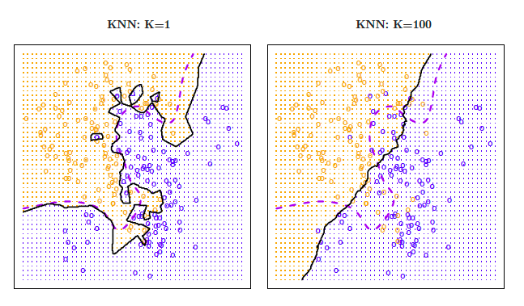
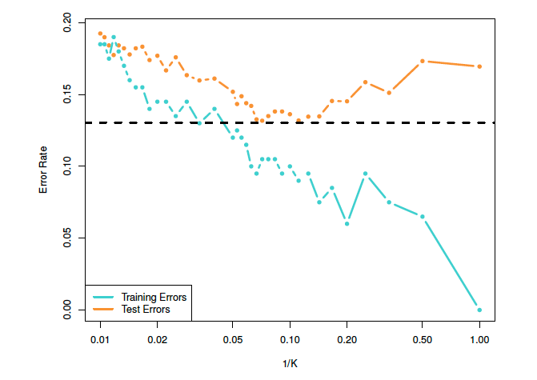

```{r echo=FALSE, message=FALSE, warning = FALSE}
library(tidyverse)
library(knitr)
library(mosaic)
library(Metrics)


hook_output = knit_hooks$get('output')
knit_hooks$set(output = function(x, options) {
  # this hook is used only when the linewidth option is not NULL
  if (!is.null(n <- options$linewidth)) {
    x = xfun::split_lines(x)
    # any lines wider than n should be wrapped
    if (any(nchar(x) > n)) x = strwrap(x, width = n)
    x = paste(x, collapse = '\n')
  }
  hook_output(x, options)
})

```

```{css, echo = FALSE}
.tiny .remark-code { /*Change made here*/
  font-size: 70% !important;
}
```


## Announcements

**Mini Project 2** You tried to warn me... please upload to the assignment labeled "UPLOAD HERE" and not the one labeled "NOT HERE" (I changed the assignment names last night)

**Lab 6**: Due tonight at in Blueline

**Mini Project 3**

- Details on Thursday

**Lab 7**: work day in class on Thursday

- Due next Tuesday


---
## "Lazy" learning

So far we've focused on building models that can predict outcomes on a new set of data. Another approach is to just be _lazy_!

__Lazy learning__: no assumptions necessary to classify data

- How does that work?

__Example__: Consider the plot below - describe the relationship between x and y.

```{r, echo=FALSE, fig.align='center', fig.height=4.5, fig.width=7}
set.seed(365)
x1 <- runif(min=0.1, max=0.5, n=20)
x2 <- runif(min=0.3, max=0.7, n=20)
x3 <- runif(min=0.5, max=0.9, n=20)
y1 <- runif(min=0.5, max=0.7, n=20)
y2 <- runif(min=0.4, max=0.6, n=20)
y3 <- runif(min=0.2, max=0.5, n=20)
x <- c(x1, x2, x3)
y <- c(y1, y2, y3)
group <- c(rep('A', 20), rep('B', 20), rep('C', 20))
data <- as.data.frame(cbind(x, y, group))
colnames(data) <- c('x', 'y', 'group')
data$x <- as.numeric(data$x)
data$y <- as.numeric(data$y)
ggplot(data, aes(x=x, y=y))+geom_point(size = 3)
```

---
## "Lazy" learning

What if the data points belonged to three different groups, like this?

```{r, echo=FALSE, fig.align='center', fig.height=6.5, fig.width=8}
ggplot(data, aes(x=x, y=y, group=group))+geom_point(aes(col=group,pch=group), size = 4)+scale_color_brewer(palette='Set1')
```

---
## "Lazy" learning

How should a new data point, $(0.2, 0.5)$ be classified? What about $(0.4, 0.2)$?

```{r, echo=FALSE, fig.align='center', fig.height=6.5, fig.width=8}
new.points <- data.frame(x = c(0.2, 0.4), y = c(0.5, 0.2), group=c('Point 1', 'Point 2'))
data.new <- rbind(data, new.points)
ggplot(data.new, aes(x=x, y=y, group=group))+geom_point(size = 5, aes(col=group, pch=group))+scale_color_brewer(palette='Set1')
```

---
## Bayes Classifier

A good classifier minimizes Testing Error, the probability of mis-classifying an input

Bayes Classifier assigns each observation $x_0$ to is most likely class using:

$$f(j) = \arg\max_j P(Y = j|X = x_0)$$
+ Bayes Classifier produce the lowest possible test error rate [(proof)](https://www.ee.columbia.edu/~vittorio/BayesProof.pdf)

**Problem**: Don't know the conditional distribution (if we did, we wouldn't need a classifier...)

---
## $k$-nearest neighbor ($k$-NN or KNN) classifier: 


A non-parametric supervised learning method that estimates the conditional probability.

- In $k$-NN classification, the output is a class membership. An object is classified by a plurality vote of its neighbors, with the object being assigned to the class most common among its $k$ nearest neighbors ($k$ is a positive integer). 


---
## KNN for Classification Steps

In the KNN algorithm, $k$ specifies the number of neighbors and its algorithm to classify a new input $x$ is as follows:

<!-- - Choose the number $k$ of neighbors -->
- Find the $k$ Nearest Neighbors to $x$ using distance
  + Euclidean Distance: $d(p,q) = \sqrt{\sum^n_{i=1}(p_i - q_i)^2}$
- Among the $k$ nearest neighbors, count the number of data points in each category (or find the conditional probability the new point $(x_0)$ is in category *j*).
  + $P(Y=j|X=x_0) = \frac{1}{k}\sum_{i \in N_0}I(y_i = j)$
- Assign the new data point to a category, where you counted the most neighbors/highest probability from formula above.

---
## KNN for Classification Steps

```{r, echo=FALSE, out.width="75%", fig.align='center'}
knitr::include_graphics("./images/knn-pic.png")
```

---
## `knn()`

__Example__: Let's classify our new points using $k=2$.

```{r}
library(class)
knnModel = knn(train = data[,1:2], 
               test = new.points[,1:2], 
               cl = data$group, 
               k = 2, prob = TRUE)
knnModel
```

---
## `knn()`

What if we use more points, $k=10$?

```{r}
knnModel = knn(train = data[,1:2], 
               test = new.points[,1:2], 
               cl = data$group, 
               k = 10, prob = TRUE)
knnModel
```

---
## Advantages and disadvantages of $k$-nearest neighbors

- The algorithm is easy to implement and straight forward. 

- Sometimes it is hard to decide the $k$ value.
  + With more variables included, the accuracy will be affected.
  + Sensitive to outliers
  + may require scaling data
- To provide accurate classification, KNN requires a lot of observations relative to the number of predictors—that is, $n$ much larger than $p$.

- Since using Euclidean distance, can only use quantitative predictors

---
## Choice of k

```{r, echo=FALSE, out.width="75%", fig.align='center'}

```

+ *k* = 1: low bias, but high variance
+ *k* = 100: low variance, but high bias

---
## Choice of k

```{r, echo=FALSE, out.width="95%", fig.align='center'}

```


---
## Example: Credit Utilization

__Example__: Can we use KNN to predict which utilization quantile a new customer falls into based on their application data?

```{r}
library(ISLR)
data(Credit)

Credit <- Credit %>% mutate(Utilization = Balance/Limit) %>% 
  mutate(Quartile = ifelse(Utilization<0.01851, 'Q1', 
                           ifelse(Utilization<0.09873, 'Q2',
                           ifelse(Utilization<0.14325, 'Q3',
                                  'Q4'))))

```

---
## Example: Credit Utilization

We want to predict the utilization quantile based on two application characteristics: credit rating and age.

```{r, echo=FALSE, fig.align='center', fig.height=6, fig.width=7}
ggplot(Credit, aes(x=Age, y=Rating, group=Quartile)) + 
  geom_point(aes(col=Quartile, pch=Quartile), size = 3) + 
  scale_color_brewer(palette='Set1')
```

---
### Example: Credit Utilization

New applicants:

Name|Age|Credit Rating
---|---|---
Lacey|33|750
Zach|47|400
Ashlee|21|250

```{r, echo = FALSE}
applicants <- data.frame(Age = c(33, 47, 21), 
                         Rating = c(750, 400, 250), 
                         Quartile=c('New', 'New', 'New'))
```


Plotting the new applicants. Use `fct_relevel()` to reorder the categories.

```{r, echo = FALSE}
old = Credit %>% dplyr::select(Age, Rating, Quartile)
full = rbind(old, applicants)
full = full %>%
  mutate(Quartile = fct_relevel(Quartile,
                                "Q1", "Q2", "Q3", "Q4", "New"))
#str(full$Quartile)

```


```{r, fig.align='center', fig.height=4, fig.width=9, echo = FALSE}
ggplot(full, aes(x=Age, y=Rating, group=Quartile)) + 
  geom_point(aes(col=Quartile, pch=Quartile), size = 3) + 
  scale_color_brewer(palette='Set1')
```

---
## Example: Credit Utilization

Fit a first model with $k=10$.

```{r}
knn10 = knn(train = old[,1:2],
            test = applicants[,1:2],
            cl = old[,3], 
            k = 10, prob = TRUE)
knn10
```

---
## Example: Credit Utilization

What if we use $k=20$?

```{r}
knn20 = knn(train = old[,1:2],
            test = applicants[,1:2],
            cl = old[,3], 
            k = 20, prob = TRUE)
knn20
```

---
## Example: Credit Utilization
Going bigger: $k=100$

```{r}
knn100 = knn(train = old[,1:2],
            test = applicants[,1:2],
            cl = old[,3], 
            k = 100, prob = TRUE)
knn100
```

---
## Evaluate Prediction Accuracy

__Example__: Let's add some more dimensions to the model. We want to know if k-nearest neighbor is effective at predicting quartile membership using an applicant's age, credit rating, income, number of existing credit cards, and education level. I'll randomly select 100 observations for testing, and assign the other 300 to my training data set.

```{r}
set.seed(365)
test_ID = sample(1:nrow(Credit), size = 100)
TEST = Credit[test_ID,]
TRAIN = Credit[-test_ID, ]
```

---
## Evaluate models 

Now, we'll set the testing data as "new data", and make predictions using the k-nearest neighbors from the training data.

```{r}
knn_train = TRAIN %>% dplyr::select(Age, Rating, Income, Cards, Education)
knn_test = TEST %>% dplyr::select(Age, Rating, Income, Cards, Education) 

knn50 = knn(train = knn_train, 
            test = knn_test,
            cl = TRAIN$Quartile, 
            k = 50, prob = TRUE)
knn50

```

---
## Evaluate models 

Now, we'll set the testing data as "new data", and make predictions using the k-nearest neighbors from the training data.

```{r}
#Create Confusion Matrix
t = table(knn50, TEST$Quartile)
t

sum(diag(t))/nrow(TEST) #Classification Accuracy

```

---
## Scaling Data

Prevents features with larger magnitudes from dominating the distance calculation (not always necessary)

```{r}
knn_train_scale <- knn_train %>% scale()
knn_test_scale <- knn_test %>% scale()

knn50_scale = knn(train = knn_train_scale, 
            test = knn_test_scale,
            cl = TRAIN$Quartile, 
            k = 50, prob = TRUE)


t_scale = table(knn50_scale, TEST$Quartile)

sum(diag(t_scale))/nrow(TEST) #Classification Accuracy

```

---
### KNN for Regression 

Can also use KNN to predict a quantiative response (alternative to Linear Regression)

In the KNN algorithm, $k$ specifies the number of neighbors and its algorithm is as follows:

- Choose the number $k$ of neighbors
- Find the $k$ Nearest Neighbor of an unknown data point using distance.
  + Euclidean Distance: $d(p,q) = \sqrt{\sum^n_{i=1}(p_i - q_i)^2}$
- Estimates $f(x_0)$ (response value of the new observation) using the average of all the training responses of the $k$ Nearest Neighbors
  + $\hat{f}(x_0) = \frac{1}{K}\sum_{x_i \in N_0}y_i$

---
## Example: Credit Utilization


```{r}
knn_train = TRAIN %>% dplyr::select(Age, Rating, Income, Cards, 
                                    Education)
knn_test = TEST %>% dplyr::select(Age, Rating, Income, Cards, 
                                  Education) 

knn50 = FNN::knn.reg(train = knn_train, 
            test = knn_test,
            y = TRAIN$Utilization, 
            k = 50)

head(knn50$pred, n = 5)

rmse(TEST$Utilization, knn50$pred)

```

---
## Linear Regression vs KNN Regression

**In General**: 

.center[
Parametric approaches will outperform nonparametric approaches if the parametric form that has been selected is close to the true form of the data
]

<br>

So in situations where the relationship is nonlinear, KNN regression may perform better than Linear Regression

- But, Linear Regression may actually perform better than KNN as the number of variables (dimensions) increase
  + Curse of dimensionality

  
---
## Try by yourself

1. Let's see whether we can predict people's ethnicity based on their credit card information (Age, Rating, Income, Cards, Education, Balance). Try to fit a KNN model with K = 5, 10, 25, 50, 100. See how the prediction values change and think about why. Write a function/loop to help

2. Run a multiple linear regression model on the same data, and compare the RMSE with the KNN regression model. Which method is performing better? Will increasing/decreasing *k* lower the RMSE?

---
## Summary 

Linear model: The basic model for regression, easy for interpretation, but has strict assumption thus hard to get a better prediction

Decision tree: Can be applied to regression and classification. Has good data visualization but it has high variance. 

Random Forest: a collection of tree models. Hard for interpretation but it can output variable importance. Can be useful if you have a lot of variable and what want to select the most useful ones. Also, if you have variables are not independent with each other, it performs better than the linear model. 

KNN：Can be applied to regression and classification. relatively fast, no assumption need and add data anytime. May affect the accuracy if we have too many variables and need to use CV to decide the k value. 
