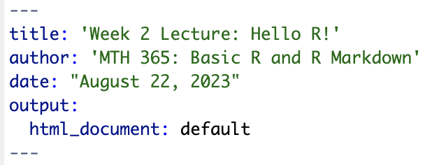

```{r echo=FALSE, message=FALSE, warning = FALSE}
library(tidyverse)
library(knitr)

hook_output = knit_hooks$get('output')
knit_hooks$set(output = function(x, options) {
  # this hook is used only when the linewidth option is not NULL
  if (!is.null(n <- options$linewidth)) {
    x = xfun::split_lines(x)
    # any lines wider than n should be wrapped
    if (any(nchar(x) > n)) x = strwrap(x, width = n)
    x = paste(x, collapse = '\n')
  }
  hook_output(x, options)
})

```


## Agenda

- What is R Markdown?
- R Markdown set-up
- Looking at an actual R Markdown Document

**Notes Document**: MTH-365-Week2.Rmd


---
## Announcements

- Introduction Questionnaire in BlueLine due **Thursday August 24 at 11:59 pm**
  + Should take approximately 5 minutes
- Start Lab 1 in class on Thursday!
  + Due **Tuesday August 29th, 2023 at 11:59 pm**

**TA Information**: Kaylee Van Handel
  - Office Hours starting next week: Tuesdays 6:30-7:30 and Wednesdays 5:00-6:00
  - Office TBA, but she will post an announcement once she has this information


---
## What do you use to write?

- Microsoft Word
- Latex/Overleaf
- Pages
- Google Docs

How do we get your results from `R` into those documents?

---
## Knit what?

- R Markdown adds (knits) `R` code into your document so that all of the files for a particular experiment are in one place.
- Compiling the document also runs the `R` code, so one button press runs your statistical analysis and places it in your document.
- Integrates `R` output with the document text so that pictures, tables, and numerical data are all depdendent on the `R` code.
- Produces beautiful, seamless integration of statistical analysis with scientifc writing

---
## Reproduceable Research

- Journals often require code and data to be included in a paper submission so the analysis can be reproduced
- Statistical analyses are often re-used for multiple similar experiments
- We don't always comment code when we write it (though we should) - `knitr` provides context for the code by including the writeup with the code.

---
## What is *R* Markdown?

* Straight from the [R Markdown home page](http://rmarkdown.rstudio.com/):

  - R Markdown documents are fully reproducible. Use a productive *notebook interface* to weave together narrative text and code to produce elegantly formatted output. Use multiple languages including `R`, Python, and SQL.

A lot of what is presented here can be found on the [R Markdown Cheatsheet](https://www.rstudio.com/wp-content/uploads/2015/02/rmarkdown-cheatsheet.pdf). 

---

## Set-Up

Install the `R Markdown` Package

```{r, eval = FALSE}
install.packages("rmarkdown")
```

  - This alone will allow you to create `HTML` and Word documents (if you have Word installed)
  
If you want to create pdfs: install TinyTex

```{r, eval = FALSE}
install.packages("tinytex")
library(tinytex)
install_tinytex()
```

- [Installation Help](https://bookdown.org/yihui/rmarkdown/installation.html)

---
## Creating a *R* Markdown Document

File -> New File -> R Markdown (This tells RStudio to use knitr to compile the document)


```{r, echo=FALSE, out.height="40%", out.width="60%"}
knitr::include_graphics("../Week 2/images/markdown.png")
```

---

## Contents of a .Rmd

1. An (optional) YAML header surrounded by `---s`
2. Code chunks beginning with ````{r}`
3. Text mixed with simple text formatting (the markdown)


---
## YAML Front Matter

The stuff at the top of the .Rmd file (called YAML front matter) tells **rmarkdown** what output format you want. 

```{r, echo=FALSE, out.height="40%", out.width="60%"}

```


In this case, when you click "Knit", RStudio calls `rmarkdown::render("file.Rmd", html_document())`. You can certainly change these default values. 

---
## What is a code chunk?

In .Rmd files, you can start/end a code chunk with three back-ticks. `knitr` knows that text is R code if it is included in a chunk.


```{r, echo=FALSE}
knitr::include_graphics("../Week 2/images/code-chunk.png")
```


When you render your .Rmd file, R Markdown will run each code chunk and embed the results beneath the code chunk in your final report.


---
## Create Code Chunk:

```{r, echo=FALSE}
knitr::include_graphics("../Week 2/images/create-code-chunk.png")
```

---
## knitr Code Chunk Options

We may want to remove the messages (the italic text) from our R output in the pdf. Or, we might not want to show the code at all. `\(\\\)`

knitr has options to give you greater control over what is shown in the compiled document. 

Let's look at these options in [the documentation](https://yihui.org/knitr/options/) 

---
## knitr Code Chunk Options

- eval=FALSE: don't run the code

- echo=FALSE: don't show the code

- warning=FALSE: don't add R's warnings to the pdf

- message=FALSE: don't show messages from R in the pdf

- include=FALSE: don't include any R output in the document. 

- cache=FALSE: re-run all of the code every time.

---
## Markdown

Any writing, written using the Markup syntax 

```
This is a really smart sentence you wrote. 

### You can Bold your headers

You also emphasize *important* words. 

You can also **bold** important words.
```
This is a really smart sentence you wrote. 
### You can Bold your headers
You also emphasize *important* words. $\\$
You can also **bold** important words

---
## Run Document

Click `Knit`

```{r, echo=FALSE}
knitr::include_graphics("../Week 2/images/KnitNotebook.png")
```

---
## Next: Go to Markdown Document in BlueLine
