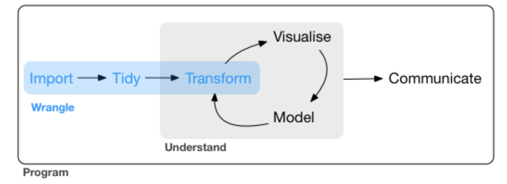
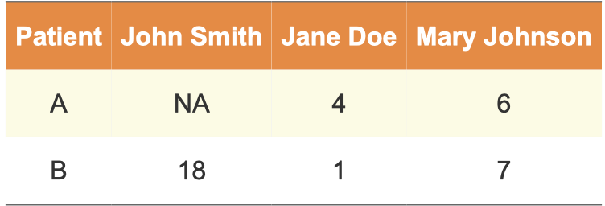

```{r echo=FALSE, message=FALSE, warning = FALSE}
library(tidyverse)
library(knitr)
library(ggsci)
library(gridExtra)

hook_output = knit_hooks$get('output')
knit_hooks$set(output = function(x, options) {
  # this hook is used only when the linewidth option is not NULL
  if (!is.null(n <- options$linewidth)) {
    x = xfun::split_lines(x)
    # any lines wider than n should be wrapped
    if (any(nchar(x) > n)) x = strwrap(x, width = n)
    x = paste(x, collapse = '\n')
  }
  hook_output(x, options)
})

```


## Agenda

+ dplyr
  - `select()`
  - `filter()`
  - `mutate()`
  - `arrange()`
  - `summarize()`
+ Joining data
)


---
## Announcements


---
### What is Data Wrangling?

Most **Data Sets** are made up of *rows* and *columns*. They are  a collection of *values*: these can be *numbers* (quantitative) or character *strings* (qualitative)

**Data Wrangling** can be defined as the process of cleaning, organizing, and transforming  raw data into the desired format for analysts to use for prompt decision making. Also known as data cleaning.

```{r, echo=FALSE}



```
[Data Wrangling Flowchart](https://r4ds.had.co.nz/wrangle-intro.html) by Hadley Wickham and Garrett Grolemund

---

### Why do you need this "Data Wrangling" Skill?

- Data wrangling helps to improve data usability as it converts data into a compatible format for the end system.

- It helps to quickly build data flows within an intuitive user interface and easily schedule and automate the data-flow process.

- Integrates various types of information and their sources (like databases, web services, files, etc.)

- Help users to process very large volumes of data easily and easily share data-flow techniques.

[Source](https://www.simplilearn.com/data-wrangling-article#:~:text=Data%20wrangling%20helps%20to%20improve,automate%20the%20data%2Dflow%20process)

---
### Messy Data

Five main ways tables of data tend not to be tidy:

1. Column headers are values, not variable names.

2. Multiple variables are stored in one column.

3. Variables are stored in both rows and columns.

4. Multiple types of observational units are stored in the same table.

5. A single observational unit is stored in multiple tables.

---
### What is tidy data?

```{r, echo=FALSE, out.width="90%"}

knitr::include_graphics("../Week 4/images/tidy-data-illustration.png")

```

Real datasets can, and often do, violate the three principles of tidy data in almost every way imaginable! Even when they do, sometimes we don't need the whole data for analysis. 

---
## Data is usually in a spreadsheet format, but

There are different ways of encoding the same information

.pull-left[
#### Option 1

```{r, echo=FALSE, out.width="70%"}

knitr::include_graphics("../Week 4/images/untidy1.png")

```

#### Option 2
```{r, echo=FALSE, out.width="80%"}



```
].pull-right[
#### Option 3
```{r, echo=FALSE, out.width="80%"}

knitr::include_graphics("../Week 4/images/tidy-data.png")

```
]

--

Neither 1 or 2 are "clean" versions of the data: information is part of the data structure; some implicit information is assumed

---
### dplyr

dplyr is a grammar of data manipulation, providing a consistent set of verbs that help you solve the most common data manipulation challenges.

Rules of `dyplr`:

- First argument is always a data frame
- Subsequent arguments say what to do with that data frame
- Always returns a data frame

```{r, echo=FALSE, out.width="70%", fig.align='center'}

knitr::include_graphics("../Week 4/images/dplyr.png")

```

---
### dplyr uses the Pipe (%>%) Operator

Use the pipe operator to combine dplyr functions in chain, which allows us to perform more complicated data manipulations

In programming, a pipe is a technique for passing information from one process to another.

+ Syntax:  dataframe %>% dplyr_function()
+ read %>% as "then do"
+ f(x) %>% g(y) is equivalent to g(f(x),y)
  - We pipe the output of the previous line of code as the first input of the next line of code
  

```{r, echo=FALSE, fig.align='center'}

knitr::include_graphics("../Week 4/images/pipe.png")

```


---
### dplyr Terminology

There are some of the primary dplyr verbs, representing distinct data analysis tasks:

`filter()`: Select specified rows of a data frame, produce subsets

`arrange()`: Reorder the rows of a data frame

`select()`: Select particular columns of a data frame

`mutate()`: Add new or change existing columns of the data frame (as functions of existing columns)

`summarise()`: Create collapsed summaries of a data frame

`group_by`: Introduce structure to a data frame


---
## Example: Gapminder

Gapminder is an independent Swedish foundation with no political, religious or economic affiliations. __Gapminder is a fact tank, not a think tank.__ Gapminder fights devastating misconceptions about global development. Gapminder produces free teaching resources making the world understandable based on reliable statistics. Gapminder promotes a fact-based worldview everyone can understand.  Gapminder collaborates with universities, UN, public agencies and non-governmental organizations.

```{r}
library(dslabs)
data(gapminder)
str(gapminder)
```

---
## select()

`select()`: Select command picks columns from dataframe. 

Suppose we only the gdp and region column

```{r}
gapminder %>% select(gdp, region) %>% head()
```

---
## filter()

`filter()`: selects every element of each row with the indicated filter value

```{r, echo=FALSE, out.width="80%", fig.align='center'}

knitr::include_graphics("../Week 4/images/filter.png")

```

---
## filter()

```{r}
gapminder2000 = gapminder %>% 
  filter(year == 2000)
```

We can also combine the functions!

```{r}
gapminder %>% 
  filter(year == 2000) %>%
  select(gdp, region, year) %>% head()
```

---
## filter()

Now, let's take a look at the scatter plot between fertility and infant_mortality for year 2000 only. 

```{r, warning=FALSE, fig.height=5, fig.width=8}
gapminder2000 %>% ggplot(aes(x = fertility, y = infant_mortality)) + 
  geom_point(aes(color = region))
```


---
## filter() Operations

| Operator | Definition | Operator | Definition |
|:---------:|:-----:|:------:|:------:|
| <     | less than   |    $x\shortmid y$ |   or   |
| <=     | less than or equal to  |   is.na() |  test if NA   |
| >       | greater than    |     !is.na() |   test if not NA    |
| >=       | greater than or equal to    |     x %in% y |   test if x is in y    |
| ==       | equal to    |     !(x %in% y) |   test if x is not in y    |
| !=       | not equal to    |     !x |   not x    |
| x&y       | and    |      |       |
---
## mutate()

- Change an existing or create a new variable into the data

- create new variables based on manipulations of the old variables

- Great for calculations

.center[
```{r, echo=FALSE, out.width="60%"}

knitr::include_graphics("../Week 4/images/mutate.png")

```
]
---
## mutate()

Example: We'd like to calculate the gross domestic product per capita. Here are the variables in our data - write an expression to do this calculation.

```{r}
gapminder = gapminder %>% mutate(GDP_pc = gdp/population)

gapminder %>% select(gdp, region, population, GDP_pc) %>% head()
```

--

Next, how do we find out which countries have the high GDP per capital?

---
## arrange()

`arrange()` is an easy way to arrange your data in ascending or descending order. Right now, the data is sorted by country, then year. We could use the `arrange()` command to resort in terms of another variable.

```{r}
gapminder %>%
  select(country, year, GDP_pc, continent) %>%
  arrange(GDP_pc) %>%
  head()
```
---
## arrange()

Default is to sort by ascending order. If we want to sort by descending:

```{r}
gapminder %>%
  select(country, year, GDP_pc, continent) %>%
  arrange(desc(GDP_pc)) %>% head(n=3)
```

--


We can also sort by more than two variables:

```{r}
gapminder %>%
  select(country, year, GDP_pc, continent) %>%
  arrange(continent, desc(GDP_pc)) %>%  head(n=3)
```


---
## summarize()

`summarize()`: finds the summary statistics of a metric

It collapses rows down to a single summary statistic, and removes all columns that are irrelevant to the calculation

```{r}
summary(gapminder$GDP_pc)

gapminder %>% summarise(avg = mean(GDP_pc), 
                       min = min(GDP_pc),
                       max = max(GDP_pc), 
                       sd = sd(GDP_pc))


```

--
Why are there `NA's` ?
---
## summarize()

```{r}
gapminder %>% filter(GDP_pc != "NA") %>%
  summarise(avg = mean(GDP_pc), 
            min = min(GDP_pc),
            max = max(GDP_pc), 
            sd = sd(GDP_pc), 
            N = n())
```

---
## summarize()

The `summarize()` function sometimes go with group_by function. Instead of giving the summary information for the whole data, with a group_by function, it provides the summary information by groups. 

```{r}
gapminder %>% filter(GDP_pc != "NA") %>%
  group_by(continent) %>% 
  summarise(avg = mean(GDP_pc), 
            min = min(GDP_pc),
            max = max(GDP_pc), 
            sd = sd(GDP_pc), 
            N = n())
```


---
## Your Turn!

(a). Start with the gapminder dataset, filter the data for country United States and Canada, then select fertility, infant mortality and year to be included. Then make a scatterplot of fertility and infant mortality and use color to indicate different years. Note: think about a question, whether the order of filter and select matters?

(b). Show the summary statistics (mean, sd, min, max) of GDP_pc for year 2010 for different region. Hint: You cannot use the GDP_only data, why?

---

## Joining Data

Table joins allow us to combine information stored in different tables, keeping what we need while discarding what we don't

.center[
```{r, echo=FALSE, out.width="47%"}

knitr::include_graphics("../Week 4/images/join.png")

```

[Source](https://rstudio-conf-2020.github.io/r-for-excel/filter-join.html)

]

---
## Simple Data Example

.pull-left[

```{r}
df1 <- data.frame(
  id = 1:6, 
  trt = rep(c("A", "B", "C"),
  rep=c(2,1,3)), 
  value = c(5,3,7,1,2,3))

df1
```

].pull-right[
```{r}
df2 <- data.frame(
  id=c(4,4,5,5,7,7), 
  stress=rep(c(0,1), 3),
  bpm = c(65,125,74,136,48,110))

df2
```

]

---

## left_join()

All elements in the left data set are kept

Mon-matches are filled in by NA

`right_join(`) works symmetric

```{r}
left_join(df1, df2, by="id")
```

---

## inner_join()

Only matches from both data sets are kept


```{r}
inner_join(df1, df2, by="id")
```

---
## full_join()

All ids are kept, missings are filled in with NA

```{r}
full_join(df1, df2, by="id")
```

---
## Traps of joins

Sometimes we unexpectedly cannot match values: missing values, different spelling, ...

Be very aware of things like a trailing or leading space

Join can be along multiple variables, e.g. by = c("ID", "Date")

Joining variable(s) can have different names, e.g. by = c("State" = "Name")

Always make sure to check dimensions of data before and after a join

Check on missing values; help with that: anti_join

---
## anti_join()

Return all rows from `x` without a match in `y`

```{r}
anti_join(df1, df2, by="id") # no values for id in df2

anti_join(df2, df1, by="id") # no values for id in df1


```

---
## Let's Move to the R Markdown File...
