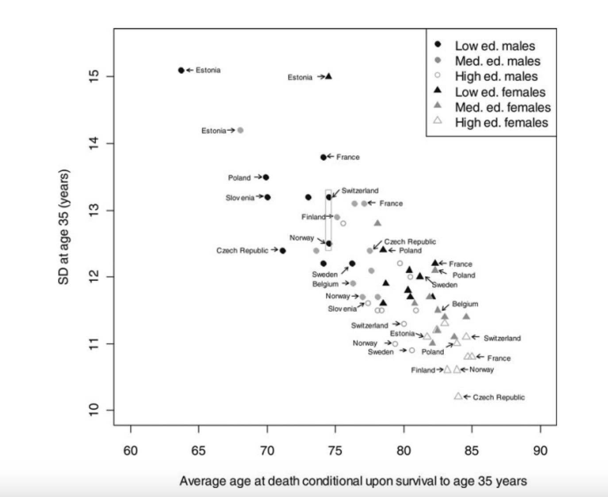
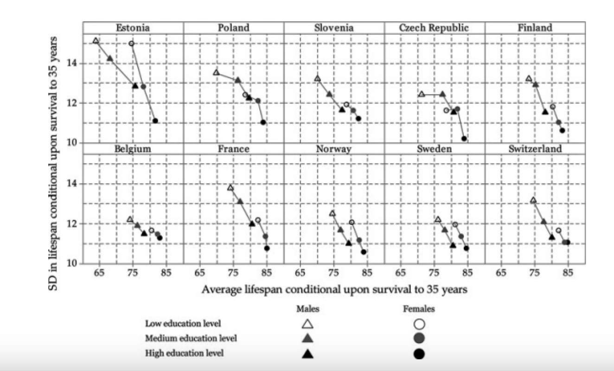

```{r echo=FALSE, message=FALSE, warning = FALSE}
library(tidyverse)
library(knitr)
library(RColorBrewer)


hook_output = knit_hooks$get('output')
knit_hooks$set(output = function(x, options) {
  # this hook is used only when the linewidth option is not NULL
  if (!is.null(n <- options$linewidth)) {
    x = xfun::split_lines(x)
    # any lines wider than n should be wrapped
    if (any(nchar(x) > n)) x = strwrap(x, width = n)
    x = paste(x, collapse = '\n')
  }
  hook_output(x, options)
})

```


## Agenda

- Introduction to Graphical Perception
  + General Guidelines
  + Color
- Data Writing
  + Figure Captions
  + Descriptive Paragraphs

---
## Announcements

+ Mini-Project 1 is due tonight!
  + Presentations on Thursday
+ Lab 3 due Tuesday September 19 at 11:59 pm 
  + No additional Lab this week


---
## Graphical Perception

To visually display data, information is encoded into a graph. The viewer then visually decodes this information, known as graphical perception, to gain knowledge. A successful graphic allows the user to perform graphical perception accurately and efficiently

In previous weeks we have discussed how to choose the right plot to visualize the data. This week we will focus on the other two principles:

- Keep it simple
- Show the data clearly

To achieve these two goals, you need to make use of several optional functions in the ggplot as well as understand what need to be include in your writing.

---
## Keep it Simple

A general guideline is to use simplicity in the design. 

- Minimize the number of unique symbols to not overload the user’s memory.
- A sample of graphics found that graphics with the best overall ratings had fewer features on average. 
- Beauty with the addition of unnecessary features does not always equal good content as attention is limited 

---
## Show the Data Clearly

Here authors wanted to display the relationship between the average lifespan and lifespan standard deviation of different countries by labeling each point by sex and education level. Additionally, they denoted the country, represented by each point, by including its name on the chart

```{r, echo=FALSE, fig.align='center', out.width="70%"}

```

---
## Show the Data Clearly

```{r, echo=FALSE, fig.align='center'}

```

---
## Show the Data Clearly: Preattentive Features

Pre-Attentive Features are things that "jump out" in less than 500 ms

+ Color, shape, angle, movement, spatial localization

There is a hierarchy of features
+ Color is stronger than shape

Reduces the amount of work users of your graph have to do when they view it

---
class:primary
# Find the Target

```{r, fig.align="center", out.height="60%", out.width="60%", echo = FALSE}
data <- data.frame(expand.grid(x = 1:6, y = 1:6), color = factor(sample(c(1, 2), 36, replace = TRUE)))
data$x <- data$x + rnorm(36, 0, .25)
data$y <- data$y + rnorm(36, 0, .25)
data$shape <- factor(c(rep(2, 15), 1, rep(2,20)))

ggplot(data, aes(x, y)) + geom_point(aes(shape = shape), size = 5, colour = "#1B9E77") + theme_void() + theme(legend.position = "none")
```

???
Find the target?

how quickly did you spot the circle?

---
class:primary
# Find the Target

```{r, fig.align="center", out.height="60%", out.width="60%", echo = FALSE}
data$shape <- factor(c(rep(2, 25), 1, rep(2, 10)))

ggplot(data, aes(x, y)) + geom_point(aes(colour = shape), size = 5, shape = I(19)) + theme_void() + theme(legend.position = "none") + scale_colour_brewer(palette="Dark2")
```


---
## Show Data Clearly: Pie vs Bar Chart

.pull-left[
```{r diamonds1, echo = FALSE, fig.align='center'}

diamonds_summary <- diamonds %>%
  group_by(cut) %>%
  summarise(Percent = n()/nrow(.) * 100)

ggplot(diamonds, aes(x = "", fill = cut)) + 
  geom_bar() +
  coord_polar(theta = "y") + ggtitle("Pie Chart")


```
].pull-right[

```{r diamonds2, echo = FALSE, fig.align='center'}
diamonds %>% ggplot() + geom_bar(aes(x=cut,fill = cut)) + ggtitle("Bar Chart")

```
]

--

Anything that can be put into a pie chart can also be put into a bar chart

- Research has shown that people have more difficulty with angle measurements than length measurements, so always prefer bar chart over pie chart. 


---
## Show Data Clearly: Color

+ Hue: shade of color (red, orange, yellow...)

+ Intensity: amount of color

+ Both color and hue are pre-attentive. Bigger contrast corresponds to faster detection.

+ Use color to your advantage

+ When choosing color schemes, we will want mappings from data to color that are not just numerically but also perceptually uniform
  - Avoid rainbow color gradients

+ Distinguish between sequential scales and categorical scales

+ Be conscious of what color means
  - Leverage common association

---
## Color

Our eyes are optimized for perceiving the yellow/green region of the color spectrum

```{r, echo=FALSE, fig.align='center', out.width="60%"}
knitr::include_graphics("../Week 5/images/color-spectrum.png")
```

---
## Gradients

Qualitative schemes: no more than 7 colors

```{r, echo=FALSE, fig.width=3, fig.height=1, out.height="35%", out.width="35%", warning=FALSE}
data <- data.frame(x = 1:7, 
                   blues = brewer.pal(7, "Blues"), 
                   set1 = brewer.pal(7, "Set1"), 
                   diverge = brewer.pal(7,"RdBu"))

qplot(xmin = x-.5, xmax = x+.5, ymin = 0, ymax = 1, data = data, geom = "rect", color = I("black"), fill = set1) + 
    scale_fill_identity() + 
    ylab("") + 
    xlab("") + 
    theme(axis.text = element_blank(), 
          axis.ticks = element_blank(), 
          rect = element_blank()) + 
    coord_fixed(ratio = 1) + 
    theme_void()
```

Quantitative schemes: use color gradient with only one hue for positive values

```{r, echo=FALSE, fig.width=3, fig.height=1, out.height="35%",  out.width="35%", warning=FALSE}
qplot(xmin = x-.5, xmax = x+.5, ymin = 0, ymax = 1, data = data, geom = "rect", color = I("black"), fill = blues) + 
    scale_fill_identity() + 
    ylab("") + 
    xlab("") + 
    theme(axis.text = element_blank(), 
          axis.ticks = element_blank(), 
          rect = element_blank()) + 
    coord_fixed(ratio = 1) + 
    theme_void()
```


Quantitative schemes: use color gradient with two hues for positive and negative values. Gradient should go through a light, neutral color (white)

```{r, echo=FALSE, fig.width=3, fig.height=1, out.height="35%", out.width="35%", warning=FALSE}
qplot(xmin = x-.5, xmax = x+.5, ymin = 0, ymax = 1, data = data, geom = "rect", color = I("black"), fill = diverge) + 
    scale_fill_identity() + 
    ylab("") + 
    xlab("") + 
    theme(axis.text = element_blank(), 
          axis.ticks = element_blank(), 
          rect = element_blank()) + 
    coord_fixed(ratio = 1) + 
    theme_void()
```

---
## Color Blindness

Not everyone perceives color in the same way. Some individuals have [colorblindness or color deficiencies](https://en.wikipedia.org/wiki/Color_blindness).

You can take a test designed to screen for colorblindness [here](https://www.eyeque.com/color-blind-test/test/).

Suggestions:
+ Design for a black-and-white photocopier
+ Use a monochromatic color gradient scheme where possible.
+ Suggested 2-color gradient: blue/purple - white - orange (safe for most types of colorblindness)
+ Utilize double encoding: use color and another aesthetic (line type, shape)
+ Avoid any scheme that uses green-yellow-red signaling if you have a target audience that may include colorblind people.
+ Can use [this website](https://colorbrewer2.org/#type=sequential&scheme=BuGn&n=3) to help pick palettes as well
+ The `viridis package` (from last week's lab) contains a set of color scales designed to span as wide a palette as possible, making it easier to see differences in your data and are also perceptually uniform.

---
## Example: Hair Color

The data `HairEyeColor` provides the information of hair colors and eye colors in a statistics class. The data is recorded in a three-way table. The first step is to convert the data into a column-wise data frame.

--
.pull-left[
```{r}
data(HairEyeColor)
HairEyeColor[,,1] #Male
```
].pull-right[
```{r}
data(HairEyeColor)
HairEyeColor[,,2] #Female
```

]
--

```{r}
newdata_male = as.data.frame(HairEyeColor[,,1]) 
newdata_female = as.data.frame(HairEyeColor[,,2]) 
newdata = rbind(newdata_male, newdata_female)
newdata = newdata %>% 
  mutate(Gender = rep(c("Male", "Female"), each  = 16))
```


---
## Example: Hair Color

```{r}
head(newdata, n = 2)
```
--
```{r}
hairData = newdata %>% 
  group_by(Hair) %>%
  summarise(Freq = sum(Freq))
hairData
```

--
Suppose now we want to see the distribution of hair color in this class. What kind of the plot we should use?

---
## Example: Hair Color

What is the difference between these two?
.pull-left[

```{r}
hairData %>% 
  ggplot(aes(x=Hair, y=Freq)) + 
  geom_col(aes(color = Hair))
```


].pull-right[

```{r}
hairData %>% 
  ggplot(aes(x=Hair, y=Freq)) +  
  geom_col(aes(fill = Hair))
```

]

---

## Example: Hair Color

What is the difference between these two?
.pull-left[

```{r}
hairData %>% 
  ggplot(aes(x=Hair, y=Freq)) + 
  geom_col(aes(color = Hair)) #<<
```


].pull-right[

```{r}
hairData %>% 
  ggplot(aes(x=Hair, y=Freq)) +  
  geom_col(aes(fill = Hair)) #<<
```

]

---
## Example: Hair Color

It is a little weird that the color in the visualization does not match the color. Let’s try to define the color by ourselves. 
```{r, fig.align='center', fig.height=5, fig.width=8}

ggplot(hairData, aes(x = Hair, y = Freq)) + 
  geom_col(aes(fill = Hair)) +
  scale_fill_manual(breaks = c("Black", "Brown", "Red", "Blond"), #<<
                    values=c("black", "brown", "red", "yellow")) #<<
```

---
## Example: Hair Color

You may have realized that in the previous figure, the color red and brown are pretty close. For an extreme case, what if you have a reader who is color-blind? There are a lot of [research](https://jfly.uni-koeln.de/color/) on which palette then to use.

```{r, fig.height=4, fig.width=8, fig.align='center'}
cbPalette <- c("#000000","#E69F00","#56B4E9","#009E73","#F0E442")

ggplot(hairData, aes(x = Hair, y = Freq)) + 
  geom_col(aes(fill = Hair)) +
  scale_fill_manual(values=cbPalette)
```

---
## Try it for yourself!!

Now try by yourself (or with a group) with another type of figure.

(a). Use the iris data below. Plot the figure to show the relation between Sepal.Length and Petal.Length.
```{r}
data(iris)
```

(b). Use colors to distinguish the species. Which function you have used? fill or color?

(c). Use red to represents `virginica`, blue to represents `versicolor`, and yellow to represents `setosa`.

(d). Use the color blind friendly color to distinguish three different species

(e). Besides of the color, use different shape of the points to represents the difference (Hint: Use Google or the Help Documentation).

---
## Try it for yourself!!

(a). Use the iris data below. Plot the figure to show the relation between Sepal.Length and Petal.Length.
```{r, fig.align='center', fig.height=4.5, fig.width=8}
data(iris)

ggplot(iris, aes(x = Sepal.Length, y = Petal.Length)) + 
  geom_point()
```


---
## Try it for yourself!!

(b). Use colors to distinguish the species. Which function you have used? fill or color?

```{r, fig.align='center', fig.height=5, fig.width=8}
ggplot(iris, aes(x = Sepal.Length, y = Petal.Length, 
                 group = Species)) + 
  geom_point(aes(color = Species)) #<<
```


---
## Try it for yourself!!

(c). Use red to represents `virginica`, blue to represents `versicolor`, and yellow to represents `setosa`.

```{r, fig.align='center', fig.height=4, fig.width=8}
ggplot(iris, aes(x = Sepal.Length, y = Petal.Length, 
                 group = Species)) + 
  geom_point(aes(color = Species)) + 
  scale_color_manual(breaks = c("virginica", "versicolor", "setosa"), #<<
                     values=c("red", "blue", "yellow")) #<<
```

---
## Try it for yourself!!

(d). Use the color blind friendly color to distinguish three different species

```{r, fig.align='center', fig.height=4, fig.width=8}
cbPalette <- c("#000000", "#E69F00", "#56B4E9") #<<

ggplot(iris, aes(x = Sepal.Length, y = Petal.Length, 
                 group = Species)) + 
  geom_point(aes(color = Species)) + 
  scale_color_manual(values=cbPalette) #<<
```


---
## Try it for yourself!!

(e). Besides of the color, use different shape of the points to represents the difference (Hint: Use Google or the Help Documentation).

```{r, , fig.align='center', fig.height=4, fig.width=8}
ggplot(iris, aes(x = Sepal.Length, y = Petal.Length, 
                 group = Species)) + 
  geom_point(aes(color = Species, shape = Species)) + #<<
  scale_color_manual(values=cbPalette)
```


---
## Writing About Your Figure

Your visualizations should include:

- Clearly labeled axes
- Clear and descriptive captions
- Readable and easily understandable legends (if applicable)
---
## Labels

(a). Use plain English $\\$
(b). If there is mathematically symbols in your label, use `expression`:

```{r, fig.height=4, fig.width=8, fig.align='center'}
x = -5:10
y = x^2
xy = data.frame(x,y)
ggplot(xy, aes(x = x, y=y)) +
  geom_point() +
  xlab("X") + ylab(expression(X^2))#<<
```

---
## Captions

There are two ways of writing a caption:

1. In-Figure Style

```{r, fig.height=3.5, fig.width=8, fig.align='center'}
ggplot(iris, aes(x=Sepal.Length, y=Petal.Length, group=Species)) + 
  geom_point(aes(color = Species, shape = Species)) + 
  scale_color_manual(values=cbPalette) +
  xlab("Sepal Length") + 
  ylab("Patal Length") +
  ggtitle("Relation between Sepal Length and Petal Length") #<<
```

---
## Captions

Formal report style: descriptive caption

1. It is not included in the figure. Usually placed below the figure.
2. Starts with the word “figure” or “table” followed by a number and a colon
3. One sentence to clearly explained What and How is being compared
4. One sentence to summarize the main conclusion.
5. Any other necessary context

```{r, echo = FALSE}
knitr::include_graphics("../Week 5/images/fig-caption.png")
```

---
## Captions

What this then looks like:

```{r fig1, fig.cap="Scatter plot between Iris sepal length and Iris petal length. Different species are indicated by different color and shapes. In general, the length of sepal and petal for Iris have a strong positive linear relationship.", echo=FALSE, fig.height=3.5, fig.width=8, fig.align='center'}
ggplot(iris, aes(x=Sepal.Length, y=Petal.Length, group=Species)) + 
  geom_point(aes(color = Species, shape = Species)) + 
  scale_color_manual(values=cbPalette) +
  xlab("Sepal Length") + 
  ylab("Patal Length") +
  ggtitle("Relation between Sepal Length and Petal Length")
```

---
## Captions

The caption only shows in the knit version of documents. Why we need a descriptive caption? How to check whether you have written a good descriptive caption?

- The reader can capture your main argument without seeing the figure
- The reader can capture the context of your figure without reading the other analysis in the formal report.

---
## Writing About Figures in Reports

A formal data analysis report requires you to answer the question with a figure and explain the potential reasons behind the figure image. Sometimes you need multiple figures to answer one question and sometimes you can answer multiple questions with one figure.

Once you generate one figures, here is what you should do:

- Re-introduce the visualization and main argument
- Cite any statistical evidence or figure characteristics to support your argument
- State secondary argument and other information
- Contrast with the other figures if necessary
- Provide potential reasons and explain the conclusion

Note: *HTML* documents do not automatically generate "Figure 1", you must add that into the caption for referencing. However, *PDF* documents do. 

---
## Example: Writing About Figures in Reports

Figure 2 indicates that there is no linear relationship between iris sepal width and petal width since the scatter plot did not show a clear linear shape on the distribution of the point.

Meanwhile, the three species does have clear different distributions of the sepal width and petal width and within a species, the the sepal width and petal width may have a positive linear relationship except Setosa, which does not have a clear trend.

The relative size of different iris species is similar to what we have found in Figure 1, where Virginica tends to have the largest size among all three while Setosa is the smallest. One of the potential reasons for the different sizes may be the habitat condition while Virginica tends to grow in the places with enough sunshine but Setosa prefers relatively dark and wet environment.

---
## Your turn!

Try to write a paragraph the following figure:

```{r , fig.cap="Scatter plot between Iris sepal length and Iris petal length. Different species are indicated by different color and shapes. In general, the length of sepal and petal for Iris have a strong positive linear relationship.", echo=FALSE, fig.height=3.5, fig.width=8, fig.align='center'}
ggplot(iris, aes(x=Sepal.Length, y=Petal.Length, group=Species)) + 
  geom_point(aes(color = Species, shape = Species)) + 
  scale_color_manual(values=cbPalette) +
  xlab("Sepal Length") + 
  ylab("Patal Length") +
  ggtitle("Relation between Sepal Length and Petal Length")
```

---
## Word Choice

In data writing, it is quite important that you know how to use different word to show your confidence in the statement. This is subjective but here is a list of words you may need, listed from the highest confidence to the lowest:

`demonstrates`

`shows`

`indicates`

`illustrates`

`reveals`

`suggests`

`might indicate`

`may suggest`

`seems to suggest`

---
## Referencing Figures: Optional

The `bookdown` package in R allows cross-referencing, which is a useful way of directing your readers through your document 

More information can be found [here](https://bookdown.org/yihui/rmarkdown-cookbook/cross-ref.html)

