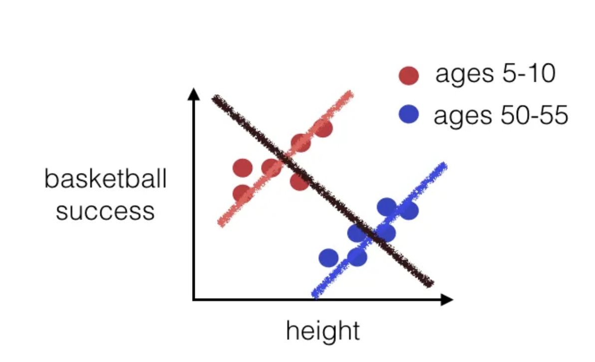

```{r echo=FALSE, message=FALSE, warning = FALSE}
library(tidyverse)
library(knitr)
library(RColorBrewer)
library(mosaic)
library(infer)


hook_output = knit_hooks$get('output')
knit_hooks$set(output = function(x, options) {
  # this hook is used only when the linewidth option is not NULL
  if (!is.null(n <- options$linewidth)) {
    x = xfun::split_lines(x)
    # any lines wider than n should be wrapped
    if (any(nchar(x) > n)) x = strwrap(x, width = n)
    x = paste(x, collapse = '\n')
  }
  hook_output(x, options)
})

```

## Announcements

**Lab 4**

- Due Thursday, February 27th at 11:59 pm in Blueline

**Lab 5**: work day in class *next* Thursday (March 6th)

- Due Tuesday, March 18 at 11:59 pm in Blueline (Tuesday after spring break)

**Mini Project 2**

- Due Thursday, March 20 at 11:59 in Blueline (Thursday after spring break)


---
## Isn't this data science?

- **Statistics** is a branch of mathematics which seeks to collect and interpret quantitative data. 

- **Data science** is a multidisciplinary filed which uses scientific methods, processes and system to extract information from data in a large range of forms. 

Data science techniques can provide us a clean data and its visualization but statistical theory is still useful to figure out what the data actually tells us 

---
## Samples and Population

In statistics we are interested in a **population** of cases/people/objects. However, often this population is too large to collect data on, so we take **samples** from the larger population.

Statistical methodology assumes that the cases are drawn from a much larger set of potential cases, so the given data are a sample of a larger population of potential cases. 


---
## Statistical Inference

Statistical Inference: the process of using sample data to make conclusions about the underlying population the sample came from

Before we talk about methods for statistical inference, let's discuss uncertainty
- Not only should report the point estimate, but should also quantify our uncertainty

--

What do we mean by uncertainty?

- Roughly equivalent to the notion of repeatability. 
  + You’re certain if your results are repeatable. 
  + You’re uncertain if your results are subject to a lot of statistical fluctuations.

---
## Why are Statisticians Always Uncertain?


- Our data consists of a sample
- We want to use our models to make a prediction, but there are always things that we can't account for in a model
- Our observations are subject to measurement or reporting error
- Our data arise from an intrinsically random or variable process

--

**Next**:
- Why sample?
- Requirements of a “good” sample?


---
## Example: Setting travel policy by sampling from the population

Example: You’ve been asked to develop a travel policy for business travelers going from New York City to Chicago. Assume that the `nycflights13` data set represents the complete population of flights.

What would we do?

Let’s first filter all the flights going to Chicago and with a non-NA value of arrival delay time.

```{r}
library(nycflights13)
Chicago <- flights %>%
  filter(dest %in% c('ORD', 'MDW'), !is.na(arr_delay))
```

---
### Let's find a Sample!

Let's take a sample (n=100)!

```{r}
set.seed(365)
Sample100 <- Chicago %>% sample_n(size=100)
```

---
## Finding Summary Statistics

How long of a delay should we expect based on the sample? We can look at the mean, minimum, maximum, quantiles, and standard deviation to get some idea.

```{r}
Sample100 %>% summarize(min=min(arr_delay),
                        q05=quantile(arr_delay, 0.05),
                        mean=mean(arr_delay),
                        median=median(arr_delay),
                        max=max(arr_delay), 
                        q95=quantile(arr_delay, 0.95),
                        sd=sd(arr_delay))
```


```{r}
mean(Chicago$arr_delay) # population value
```


---
## What constitutes an “unacceptable” delay?

How about an hour and forty-five minute delay (105 minutes)?

```{r}
Chicago %>% mutate(less105 = arr_delay<=105) %>% 
  group_by(less105) %>% 
  count() %>%
  mutate(pct = n / nrow(Chicago))
```


---
## Take Another sample


```{r}
set.seed(10)
Sample100_2 <- Chicago %>% sample_n(size=100)

Sample100_2 %>% summarize(mean=mean(arr_delay),
            min=min(arr_delay),
            max=max(arr_delay), 
            sd=sd(arr_delay))
```


The sample mean is now 9.64. Is this the same or different than the previous sample? How close is it to the population value?

--

Different samples of data will have different sample statistics!

-   In most real-world settings, we do not have access to the population data. We have only our sample.

---
## Sample Statistics

Statistic: A quantity computed from values in a sample to represent some characteristics

Examples:

+ Mean $(\bar{x})$
+ Proportion $(\hat{p})$
+ Median $(m)$
+ Standard Deviation $(s)$

These are also called **point estimates**: single value from a sample to approximate this value in the population.

---
## Sampling Distributions

Sample statistics depend completely on the data. Different samples of data will have different sample statistics!

We need to figure out the reliability of a sample statistic from the sample itself. 
  + For now, though, we are going to use the population to develop some ideas about how to define reliability. 

--

If we draw many different samples from the population, each of size $n$, and calculated the sample statistic on each of those samples, how similar would the sample statistic be across all the samples?
  + Create a sampling distribution

--

**Sampling distribution**: a set of probabilities represents the chance to see certain values of the statistics
+ [Animation](https://onlinestatbook.com/stat_sim/sampling_dist/index.html)

---
## Creating a Sampling Distribution

We could run the previous code multiple times to obtain our different samples

--

Or, we could speed it up:

```{r}
n <- 100
num_trials <- 500
chi_25_means <- 1:num_trials %>% 
    map_dfr(~Chicago %>% slice_sample(n = n) %>% 
        summarize(mean_arr_delay = mean(arr_delay))) %>% 
  mutate(n = n)

head(chi_25_means)
```

---
## Creating a Sampling Distribution
```{r}
# favstats() is in the mosaic library
favstats(~mean_arr_delay, data=chi_25_means)
```

--

```{r, fig.height=4, fig.width=7, fig.align='center'}
ggplot(chi_25_means, aes(x=mean_arr_delay)) + 
  geom_density(fill='turquoise', alpha=0.5) + 
  labs(x='Sampling Distribution of Sample Mean')
```

---
## What does the Sampling Distribution tells us?

- Where is the sampling distribution centered? 
  + The expected value of a statistical summary is the average of that summary’s sampling distribution—that is, the average value of that summary under repeated sampling from the same random process that generated our data.

- How spread out is the sampling distribution? 
  + The answer to this question provides a quantitative measure of repeatability, and therefore statistical uncertainty.
  + The standard deviation of a sampling distribution is called the **standard error**. This reflects the typical statistical fluctuation of our summary statistic

---
## Discuss Reliability: Standard Error

**Standard error**: It describes the width of the sampling distribution.

$$SE = \frac{s}{\sqrt{n}}$$
--

Example: What’s the standard error of the sample mean?

```{r}
favstats(~arr_delay, data=Sample100)
```

```{r}
favstats(~mean_arr_delay, data=chi_25_means)
```


---
## Discuss Repeatability: Confidence Intervals

Now suppose we want to report a range of plausible values that have a good shot at capturing the parameter instead of just the point estimate
- Quantifying this requires a measurement of how much we would expect the sample population to vary from sample to sample

--

**Approximate 95% Confidence interval**: If generate repeated samples, 95% of those intervals will contain the true population value.


```{r, echo=FALSE, out.width="70%", fig.align='center'}

knitr::include_graphics("images/confidence-interval.png")

```


---
## Discuss Repeatability: Confidence Intervals

Example: Calculate and interpret an approximate 95% confidence interval for the mean arrival delay.

$$\bar{x} \pm 2*SE$$

```{r}
chi_25_means %>%
  summarize(
    x_bar = mean(mean_arr_delay),
    se = sd(mean_arr_delay)
  ) %>%
  mutate(
    ci_lower = x_bar - 2 * se, # approximately 95% of observations 
    ci_upper = x_bar + 2 * se  # are within two standard errors
  )

```

---
## Discuss Repeatability: Approximate 95% confidence interval

```{r, fig.height=5, fig.width=7, fig.align='center'}
ggplot(chi_25_means, aes(x=mean_arr_delay)) + 
  geom_density(fill='turquoise', alpha=0.5) + 
  labs(x='Sampling Distribution of Sample Mean') +
  geom_vline(xintercept=c(-2.61, 16.6), color="red") #<<
```

---
## How does sample size affect the sampling distribution?

```{r means, message=FALSE, warning=FALSE, cache=TRUE}
Means50 <- do(1000)*(Chicago %>% sample_n(size=50) %>% 
                       summarize(mean=mean(arr_delay)))
Means100 <- do(1000)*(Chicago %>% sample_n(size=100) %>% 
                        summarize(mean=mean(arr_delay)))
Means500 <- do(1000)*(Chicago %>% sample_n(size=500) %>% 
                        summarize(mean=mean(arr_delay)))
```

```{r, message=FALSE, warning=FALSE, fig.align='center', fig.height=4, fig.width=8, echo=FALSE}
Means <- rbind(Means50 %>% mutate(n=50),
               Means100 %>% mutate(n=100),
               Means500 %>% mutate(n=500))
```

```{r, message=FALSE, warning=FALSE, fig.align='center', fig.height=4, fig.width=8, echo=FALSE}
ggplot(dat=Means, aes(x=mean)) + 
  geom_density(aes(fill=as.factor(n))) + 
  facet_grid(~n)+xlab('Sample means') + guides(fill=FALSE)
```


---
## How does sample size affect the sampling distribution?


A larger sample size produces a smaller standard error. 
  - A larger sample size is more reliable than a smaller sample size

--

What happens to the confidence interval as the standard error decreases?

--

+ Smaller Interval

--

For large sample sizes, the shape of the sampling distribution tends to bell-shaped


---
## Bootstraping

In the last example, we had access to the population data and so we could find the sampling distribution by repeatedly sampling from the population. 

--

**Bootstrap** is a method that allows us to approximate the sampling distribution even though we do not have the population.

In bootstraping we think of our sample as if it were the population. 
  - Still drawing many new samples from our original sample (**Resampling**). 

When resampling, we sample with replacement.
  - Allows us to estimate the variability of the sample
  - Otherwise, would always get the same sample statistics as the observed value.

Bootstrapping does not create new cases (not for data collection)

---
## Bootstraping

```{r, echo=FALSE, fig.align='center'}

knitr::include_graphics("images/bootstrap.png")

```

  
---
## Bootstraping: Let's take a small sample (n=3)

```{r}
f3 <- Chicago %>% sample_n(size=3) %>% dplyr::select(year,month,day)
```

```{r, echo=FALSE}
f3 
```

--

.pull-left[
First Resample: 
```{r}
f3 %>% slice_sample(n= 3, 
               replace = TRUE)
```
].pull-right[
Second Resample: 
```{r}
f3 %>% slice_sample(n= 3, 
               replace = TRUE)
```
]

---
## Bootstrapping: Bigger Sample

```{r, fig.height=4.5, fig.width=8, fig.align='center'}
Bootstrap_Means <- Sample100 %>% 
  specify(response = arr_delay) %>%
  generate(reps = 500, type = "bootstrap") %>%
  calculate(stat = "mean")

ggplot(Bootstrap_Means, aes(x=stat))+
  geom_density(fill='turquoise', alpha=0.5)+labs(x='Bootstrap Means')

```

---
## Bootstrapping: Bigger Sample


Bootstrap Sample:
```{r}
favstats(~stat, data=Bootstrap_Means)
```

Sampling Distribution:
```{r}
favstats(~mean_arr_delay, data=chi_25_means)
```

--

For moderate to large sample sizes and sufficient number of bootstraps, the bootstrap distribution approximates certain aspects of the sampling distribution, like the standard error and quantiles 


```{r, echo=FALSE, fig.align='center', fig.height=6, fig.width=8, eval = FALSE}
Boot1 <- Chicago %>%
  sample_n(size=100) %>% 
  specify(response = arr_delay) %>%
  generate(reps = 1000, type = "bootstrap") %>%
  calculate(stat = "mean")

Boot2 <- Chicago %>%
  sample_n(size=100) %>% 
  specify(response = arr_delay) %>%
  generate(reps = 1000, type = "bootstrap") %>%
  calculate(stat = "mean")

Boot3 <- Chicago %>%
  sample_n(size=100) %>% 
  specify(response = arr_delay) %>%
  generate(reps = 1000, type = "bootstrap") %>%
  calculate(stat = "mean")

BootSamples <- rbind(Boot1 %>% mutate(Sample=1), 
               Boot2 %>% mutate(Sample=2), 
               Boot3 %>% mutate(Sample=3))
ggplot(data=BootSamples, aes(x=stat)) +
  geom_density(aes(fill=as.factor(Sample))) +
  facet_grid(~Sample)+xlab('Bootstrap Distributions') +
  guides(fill=FALSE)
```

---
## Side Note: We want Quality Samples!

The quality of bootstrap estimates depends on the quality of the collected data.
  - So we want quality samples!
  
Quality samples tend to be representative of the population of interest

--

Is this class a quality sample of all Creighton students?

---
## Outliers

Outliers: a data point that differs significantly from other observations

When you have an outlier:

- Identify the potential outlier
- Try to understand why it is an outlier
- Only remove it if you are sure it is caused by completely random error, or not related to your research focus.

---
### Confounding Variables and Simpson's Paradox

.center[
Correlation does not imply causation
]

<br>

- A common concern with observational data is that correlations are distorted by other variables -> *confounding variables*
  + Randomized trials control for this; but not always practical
  
- In observational studies, addressing confounding is straightforward if these variables are measured (ex. can add them to model)


---
### Confounding Variables and Simpson's Paradox


Simpson's paradox is a phenomenon where a trend appears in several groups of data but disappears or reverses when the groups are combined. 
- The paradox can be resolved when confounding variables are appropriately addressed, but can lead to problematic interpretations if they are not. 

```{r, echo=FALSE, fig.align='center', out.height="90%", out.width="85%"}



```


---
### Hypothesis Tests and Their Perils

Used to test an assumption about a population parameter

Made up of 4 steps:

1. Start with a null hypothesis $(H_0)$, that represents the status quo ("there is nothign going on")

2. Set an alternative hypothesis $(H_A)$, that represents the research question, i.e. what we’re testing for
  - Can be one-sided $(<,>)$ or two-sided $(\neq)$

3. Conduct a hypothesis test under the assumption that the null hypothesis is true
  - calculate a test-statistic/p-value 

4. If the test results suggest that the data do not provide convincing evidence for the alternative hypothesis, stick with the null hypothesis
  - If they do, then reject the null hypothesis in favor of the alternative


---
### Example: New England Patriots

The Patriots’ fan base is hugely devoted, probably due to their long run of success over nearly two decades. Many others, however, dislike the Patriots for their highly publicized cheating episodes, whether for deflating footballs or filming the practice sessions of their opponents. But did the Patriots cheat at the pre-game coin toss, which decides who starts the game with the ball?

Believe it or not, many people think so. That’s because, for a stretch of 25 games spanning the 2014-15 NFL seasons, the Patriots won 19 out of 25 coin tosses, for a suspiciously high 76% winning percentage. For the Patriots’ detractors, this fact was clear evidence that something fishy was going on. 

But before turning to fraud or the Force as an explanation, let’s take a closer look at the evidence. Just how likely is it that one team could win the pre-game coin toss at least 19 out of 25 times, assuming that there’s no cheating going on? We are going to examine this using a hypothesis test.


--

$H_0:$  Pre-game coin toss in the Patriots’ games was truly random during the 2014-2015 NFL seasons.

$H_A:$ Patriots won the pre-game coin toss more often than what would be expected by random chance during the 2014-2015 NFL seasons.


---
### New England Patriots: Null Distribution

Our burning question: just how likely is it that one team could win the pre-game coin toss at least 19 out of 25 times, assuming that there’s no cheating going on? We’d “expect” any given team to win only about half of its pre-game coin tosses, but we also have to account for the possibility that they just got lucky. Hence we want to simulate a random process, assuming the null hypothesis is true, called a **Null Distribution**

---
### Simulating the null distribution

```{r, fig.align='center', fig.width=10, fig.height=5}
set.seed(4)
patriots_sim = do(10000)*nflip(25)

ggplot(patriots_sim) + 
  geom_histogram(aes(x=nflip), binwidth=1)
```


---
### New England Patriots: P-value

Test Statistic:
```{r}
sum(patriots_sim >= 19)
```

--
A **p-value** is the probability of observing a test statistic as extreme, or more extreme, than what observed, given that the null hypothesis is true.

```{r, echo = FALSE, fig.align='center', fig.width=10, fig.height=4.5}
#sum(patriots_sim >= 19)

patriots_sim <- patriots_sim %>% mutate(pvalue = ifelse(nflip < 19, "less", "greater"))

ggplot(patriots_sim) + 
  geom_histogram(aes(x=nflip, fill = pvalue), binwidth=1) +
  geom_vline(xintercept = 18.5) + 
  geom_text(x=21.5, y=100, label='P(>= 19 Wins) = 0.0083', colour='black', size=5) + theme(legend.position="none")


```


---
### Making Conclusions

We often use 5% as the cutoff for whether the p-value is low enough that the data are unlikely to have come from the null model. This cutoff value is called the significance level, $\alpha$.

- If p-value < $\alpha$ , reject $H_0$ in favor of $H_A$: The data provide convincing evidence for the alternative hypothesis.

- If p-value > $\alpha$, fail to reject $H_0$ in favor of $H_A$: The data do not provide convincing evidence for the alternative hypothesis.

--

In our example, since 0.0083 < 0.05, we have evidence that the New England Patriots won the coin toss more than what would be expected by random chance during the 2014-2015 NFL season.


---
## P-Values

Using a p-value as a measure of statistical significance has both advantages and disadvantages:
- The main advantage is that the p-value gives us a continuous measure of evidence against the null hypothesis. 
  + The smaller the p-value, the more unlikely it is that we would have seen our data under the null hypothesis, and therefore the stronger (“more significant”) the evidence that the null hypothesis is false.
- The main disadvantage is that the p-value is really, really hard to interpret correctly.
  + Also has an "all or nothing" connotation

---
### P-Value Controversy

To avoid thinking too hard about what a p-value actually means, many people just shrug their shoulders and ask a simple question about any particular p-value they happen to encounter: is it less than some magic threshold? 
- Unfortunately magic thresholds don't exist

--

Need to distinguish between statistical significance and practical significance.

- Statistical significance just means whether we reject $H_0$
- Practical significance, means whether the numerical magnitude of something is large enough to matter to actual human persons
  + Hypothesis tests with small differences in values can produce very low p-values if you have large sample size or the data have low variability.
  + "Matter to human persons" isn't just, like, your opinion, man: we need to know if medicine is actually effective!


---
### New England Patriots: Conclusion

But despite the small probability of such an extreme result, it’s hard to believe that the Patriots cheated on the coin toss, for a few reasons. 

--
  - How? The coin toss would be extremely hard to manipulate, even if you were inclined to do so. 
  - The Patriots are just one team, and this is just one 25-game stretch. But the NFL has 32 teams, so the probability that at least one of them would go on an unusual coin-toss winning streak over at least one 25-game stretch over a long time period is a lot larger than the number we’ve calculated. 
  - After this 25-game stretch, the Patriots reverted back to a more typical coin-toss winning percentage, closer to 50%. 

