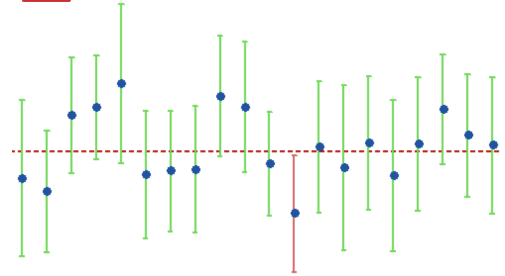
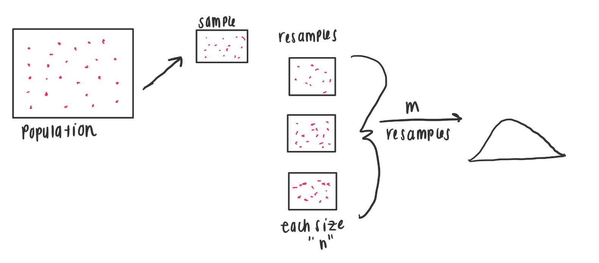

```{r echo=FALSE, message=FALSE, warning = FALSE}
library(tidyverse)
library(knitr)
library(RColorBrewer)
library(mosaic)
library(infer)


hook_output = knit_hooks$get('output')
knit_hooks$set(output = function(x, options) {
  # this hook is used only when the linewidth option is not NULL
  if (!is.null(n <- options$linewidth)) {
    x = xfun::split_lines(x)
    # any lines wider than n should be wrapped
    if (any(nchar(x) > n)) x = strwrap(x, width = n)
    x = paste(x, collapse = '\n')
  }
  hook_output(x, options)
})

```

## Agenda

- Population vs. Sampling
- Sampling Distributions
  + Standard Error
- Confidence Intervals
- Bootstrapping 

---
## Announcements

- Lab 4: **due tonight at 11:59 pm!**
- A Look Ahead:
  + Thursday - Linear Models
  + Tuesday October 3 - Lab 5
  + Thursday October 5 - Mini Project 2 work day
- Both Lab 5 and Mini-Project 2 are due after Fall Break on Tuesday October 17.


--

Notes on Lab 3:

- Please don't print our full data set
- Check your data set - see if what you did is what you were expecting.
- When asks a question, create code and then using the code develop your response

---
## Isn't this data science?

- Statistics: Statistics is a mathematically based field which seeks to collect and interpret quantitative data. 

- Data science: Data science is a multidisciplinary filed which uses scientific methods, processes and system to extract information from data in a large range of forms. 

Data science techniques can provide us a clean data and its visualization but we still reply on statistics theory to interpret what the data is trying to tell us

---
## Introduction

In data science we want to extract meaning from the data

- Data wrangling
- Visualization

Visualizations are powerful because humans are good at seeing patterns! However, we are also very good at seeing patterns that do not exist!

- Statistical Methods collect data and quantifies patterns in the data

Moral of the story: Data science techniques can provide us clean data and visualizations but we still rely on statistical theory to interpret what the data is trying to tell us

---
## Samples and Population

In statistics we are interested in a **population** of cases/people/objects. However, often this population is too large to collect data on, so we take **samples** from the larger population.

Statistical methodology assumes that the cases are drawn from a much larger set of potential cases, so the given data are a sample of a larger population of potential cases. 
  - Other samples that might have been drawn from the population.

--

**Next**:
- Why sample?
- Requirements of a “good” sample?


---
## Example: Setting travel policy by sampling from the population

Example: You’ve been asked to develop a travel policy for business travelers going from New York City to Chicago. Assume that the `nycflights13` data sets represents the complete population of flights.

What would we do?

Let’s first filter all the flights going to Chicago and with a non-NA value of arrival delay time.

```{r}
library(nycflights13)
Chicago <- flights %>%
  filter(dest %in% c('ORD', 'MDW'), !is.na(arr_delay))
nrow(Chicago)
```

---
## Let's find a Sample!

```{r}
set.seed(365)
Sample100 <- Chicago %>% sample_n(size=100)
glimpse(Sample100)
```

---
## Finding Summary Statistics

How long of a delay should we expect based on the sample? We can look at the mean, minimum, maximum, and standard deviation to get some idea.

```{r}
Sample100 %>% summarize(mean=mean(arr_delay),
                        min=min(arr_delay),
                        max=max(arr_delay), 
                        sd=sd(arr_delay))
```

---
### Finding Summary Statistics

We might also want to examine the quantiles.


```{r}
Sample100 %>% summarize(q05=quantile(arr_delay, 0.05), 
                        q25=quantile(arr_delay, 0.25),
                        median=median(arr_delay),
                        q75=quantile(arr_delay, 0.75), 
                        q95=quantile(arr_delay, 0.95))

```

Sorting the values from min to max, Quantile X means there are x% of values less than it:

  - ie. 75% of the values are less than 17.2
  
---
# What constitutes an “unacceptable” delay?

How about an one and half hour delay?

```{r}
Chicago %>% mutate(less90 = arr_delay<=90) %>% 
  group_by(less90) %>% 
  summarize(n=n())
```


---
## Take Another sample


```{r}
set.seed(10)
Sample100_2 <- Chicago %>% sample_n(size=100)

Sample100_2 %>% summarize(mean=mean(arr_delay),
            min=min(arr_delay),
            max=max(arr_delay), 
            sd=sd(arr_delay))
```


The sample mean is now 9.64. Is this the same or different than the previous sample?

--

Different samples of data will have different sample statistics!

---
## Compare to Population to Check Sample

```{r}
Sample100_2 %>% summarize(mean=mean(arr_delay), #sample
            min=min(arr_delay),
            max=max(arr_delay), 
            sd=sd(arr_delay)) 

Chicago %>% summarize(mean=mean(arr_delay), #population
            min=min(arr_delay),
            max=max(arr_delay), 
            sd=sd(arr_delay))

```

--
However, in most real-world settings, we do not have access to the population data. We have only our sample.

---
## Sample statistics

Statistic: A quantity computed from values in a sample to represent some characteristics

Examples:

+ Mean $(\bar{x})$
+ Proportion $(\hat{p})$
+ Median $(m)$
+ Standard Deviation $(s)$
+ Sample Size $(n)$


---
## Sampling Distributions

Sample statistics depend completely on the data. Different samples of data will have different sample statistics!

We need to figure out the reliability of a sample statistic from the sample itself. 
  + For now, though, we are going to use the population to develop some ideas about how to define reliability. 

--

If we draw many different samples from the population, each of size $n$, and calculated the sample statistic on each of those samples, how similar would the sample statistic be across all the samples?
  + Do so by creating a sampling distribution

--

**Sampling distribution**: a set of probabilities represents the chance to see certain values of the statistics
+ There are three components for a sampling distribution: center (mean), spread (standard error) and shape.
+ [Animation](https://onlinestatbook.com/stat_sim/sampling_dist/index.html)

---
## Creating a Sampling Distribution

We could run the previous code multiple times to obtain our different samples

--

Or, we could speed it up:

```{r}
n <- 100
num_trials <- 500
chi_25_means <- 1:num_trials %>% 
  map(~Chicago %>% slice_sample(n = n) %>% 
        summarize(mean_arr_delay = mean(arr_delay))) %>% 
  list_rbind() %>% 
  mutate(n = n)

head(chi_25_means)
```

---
## Creating a Sampling Distribution
```{r}
# favstats() is in the mosaic library
favstats(~mean_arr_delay, data=chi_25_means)
```

--

```{r, fig.height=4, fig.width=7, fig.align='center'}
ggplot(chi_25_means, aes(x=mean_arr_delay)) + 
  geom_density(fill='turquoise', alpha=0.5) + 
  labs(x='Sampling Distribution of Sample Mean')
```


---
## Discuss Reliability: Standard Error

**Standard error**: the standard deviation of the sampling distribution. It describes the width of the sampling distribution.

$$SE = \frac{s}{\sqrt{n}}$$
--

Example: What’s the standard error of the sample mean?

```{r}
favstats(~arr_delay, data=Sample100)
```

```{r}
favstats(~mean_arr_delay, data=chi_25_means)
```

--

A larger sample size produces a standard error that is smaller. That is, a larger sample size is more reliable than a smaller sample size.

---
## Discuss Readability: Approximate 95% confidence interval

**Approximate 95% Confidence interval**: If generate repeated samples, 95% of those intervals will contain the true population value.


- The interval can be used to identify plausible values for the true mean of a variable. It is calculated from the mean and standard error of the sampling distribution.

--

```{r, echo=FALSE, out.width="80%", fig.align='center'}



```


---
## Discuss Readability: Approximate 95% confidence interval

Example: Calculate and interpret an approximate 95% confidence interval for the mean arrival delay.

```{r}
chi_25_means %>%
  summarize(
    x_bar = mean(mean_arr_delay),
    se = sd(mean_arr_delay)
  ) %>%
  mutate(
    ci_lower = x_bar - 2 * se, # approximately 95% of observations 
    ci_upper = x_bar + 2 * se  # are within two standard errors
  )

```

---
## Discuss Readability: Approximate 95% confidence interval

```{r, fig.height=5, fig.width=7, fig.align='center'}
ggplot(chi_25_means, aes(x=mean_arr_delay)) + 
  geom_density(fill='turquoise', alpha=0.5) + 
  labs(x='Sampling Distribution of Sample Mean') +
  geom_vline(xintercept=c(-2.61, 16.6), color="red") #<<
```

---
## How does sample size affect the sampling distribution?

```{r means, message=FALSE, warning=FALSE, cache=TRUE}
Means50 <- do(1000)*(Chicago %>% sample_n(size=50) %>% 
                       summarize(mean=mean(arr_delay)))
Means100 <- do(1000)*(Chicago %>% sample_n(size=100) %>% 
                        summarize(mean=mean(arr_delay)))
Means500 <- do(1000)*(Chicago %>% sample_n(size=500) %>% 
                        summarize(mean=mean(arr_delay)))
```

```{r, message=FALSE, warning=FALSE, fig.align='center', fig.height=4, fig.width=8}
Means <- rbind(Means50 %>% mutate(n=50),
               Means100 %>% mutate(n=100),
               Means500 %>% mutate(n=500))
```
---
## How does sample size affect the sampling distribution?

```{r, message=FALSE, warning=FALSE, fig.align='center', fig.height=4, fig.width=8}
ggplot(dat=Means, aes(x=mean)) + 
  geom_density(aes(fill=as.factor(n))) + 
  facet_grid(~n)+xlab('Sample means') + guides(fill=FALSE)
```

---
## How does sample size affect the sampling distribution?

A larger sample size produces a smaller standard error. 
  - A larger sample size is more reliable than a smaller sample size

--

What happens to the confidence interval as the standard error decreases?

--

+ Smaller Interval

--

For large sample sizes, the shape of the sampling distribution tends to bell-shaped


---
## Bootstraping

In the last example, we had access to the population data and so we could find the sampling distribution by repeatedly sampling from the population. 
  - We typically only have one sample and not the entire population. 
  
**Bootstrap** is a method that allows us to approximate the sampling distribution even though we do not have the population.

In bootstraping we think of our sample as if it were the population. 
  - So, like before, we draw many new samples from our original sample. 
  - *Resampling*: drawing a new sample from an existing sample.

When resampling, we sample with replacement.
  - Allows us to estimate the variability of the sample
  - If we did not sample with replacement, we would always get the same sample median as the observed value.

Bootstrapping does not create new cases
  - It isn’t a way to collect data. 

---
## Bootstraping

```{r, echo=FALSE, fig.align='center'}



```

  
---
## Bootstraping: Let's take a small sample (n=3)

```{r}
f3 <- Chicago %>% sample_n(size=3) %>% dplyr::select(year,month,day)
```

```{r, echo=FALSE}
f3 
```

--

.pull-left[
First Resample: 
```{r}
f3 %>% slice_sample(n= 3, 
               replace = TRUE)
```
].pull-right[
Second Resample: 
```{r}
f3 %>% slice_sample(n= 3, 
               replace = TRUE)
```
]

---
## Bootstrapping: Bigger Sample

```{r, fig.height=4.5, fig.width=8, fig.align='center'}
Bootstrap_Means <- Sample100 %>% 
  specify(response = arr_delay) %>%
  generate(reps = 500, type = "bootstrap") %>%
  calculate(stat = "mean")

ggplot(Bootstrap_Means, aes(x=stat))+
  geom_density(fill='turquoise', alpha=0.5)+labs(x='Bootstrap Means')

```

---
## Bootstrapping: Bigger Sample


Bootstrap Sample:
```{r}
favstats(~stat, data=Bootstrap_Means)
```

Sampling Distribution:
```{r}
favstats(~mean_arr_delay, data=chi_25_means)
```

--

For moderate to large sample sizes and sufficient number of bootstraps, the bootstrap distribution approximates certain aspects of the sampling distribution, like the standard error and quantiles 

---
## Example: What if we start with a different sample?

```{r, fig.align='center', fig.height=4, fig.width=5}
NewSample <- Chicago %>% sample_n(size=100)

New_Bootstrap_Means <- NewSample %>% 
  specify(response = arr_delay) %>%
  generate(reps = 1000, type = "bootstrap") %>%
  calculate(stat = "mean")

ggplot(New_Bootstrap_Means, aes(x=stat))+
  geom_density(fill='turquoise', alpha=0.5)+
  labs(x='NEW Bootstrap Means')

```

---
## Comparison of 3 Bootstrap Distributions

```{r, echo=FALSE, fig.align='center', fig.height=6, fig.width=8}
Boot1 <- Chicago %>%
  sample_n(size=100) %>% 
  specify(response = arr_delay) %>%
  generate(reps = 1000, type = "bootstrap") %>%
  calculate(stat = "mean")

Boot2 <- Chicago %>%
  sample_n(size=100) %>% 
  specify(response = arr_delay) %>%
  generate(reps = 1000, type = "bootstrap") %>%
  calculate(stat = "mean")

Boot3 <- Chicago %>%
  sample_n(size=100) %>% 
  specify(response = arr_delay) %>%
  generate(reps = 1000, type = "bootstrap") %>%
  calculate(stat = "mean")

BootSamples <- rbind(Boot1 %>% mutate(Sample=1), 
               Boot2 %>% mutate(Sample=2), 
               Boot3 %>% mutate(Sample=3))
ggplot(data=BootSamples, aes(x=stat)) +
  geom_density(aes(fill=as.factor(Sample))) +
  facet_grid(~Sample)+xlab('Bootstrap Distributions') +
  guides(fill=FALSE)
```

---
## Side Note: We want Quality Samples!

The quality of bootstrap estimates depends on the quality of the collected data.
  - So we want quality samples!
  
Quality samples tend to be representative of the population of interest

--

Is this class a quality sample of all Creighton students?

---

## Outliers

Outliers: a data point that differs significantly from other observations

When you have an outlier:

- Identify the potential outlier
- Try to understand why it is an outlier
- Only remove it if you are sure it is caused by completely random error, or not related to your research focus.

---
## Example: Are there any outliers in the arrival delay?

```{r, message=FALSE, fig.align='center', fig.height=6.5, fig.width=9}
ggplot(Chicago, aes(x=arr_delay)) + geom_histogram()
```

---
## Example: Let's Zoom In

```{r, fig.align='center', fig.height=6, fig.width=9, message=FALSE}
Chicago %>% filter(arr_delay>400) %>% ggplot(aes(x=arr_delay)) + 
  geom_histogram()
```

---
## Example: Any commonalities?

Do the long arrival delays have anything in common?

```{r}
Chicago %>% filter(arr_delay>400) %>%
  dplyr::select(month, day, dep_delay, arr_delay, carrier)
```

---
## Your Turn!

1. Are long delays (over 2 hours) more common in particular months? 

2. Are long delays (over 2 hours) more common with certain carriers?

---
## Your Turn!

Are long delays (over 2 hours) more common in particular months? 

```{r}
Chicago %>% filter(arr_delay > 120) %>% 
  dplyr::select(month, day, dep_delay, arr_delay, carrier) %>%
  group_by(month) %>% 
  summarize(N = n())
```


---
## Your Turn!

Are long delays (over 2 hours) more common with certain carriers?

```{r}
Chicago %>% filter(arr_delay > 120) %>% 
  dplyr::select(month, day, dep_delay, arr_delay, carrier) %>%
  group_by(carrier) %>% 
  summarize(N = n()) %>%
  arrange(desc(N))
```

---
## Your Turn!

Are long delays (over 2 hours) more common with certain carriers?

```{r, fig.height=4.5, fig.width=7, fig.align='center'}
Chicago %>% 
  dplyr::select(month, day, dep_delay, arr_delay, carrier) %>%
  group_by(carrier) %>% 
  summarize(N = sum(arr_delay > 120)/n()) %>%
  ggplot(aes(x = carrier, y = N)) + 
  geom_col()
```

