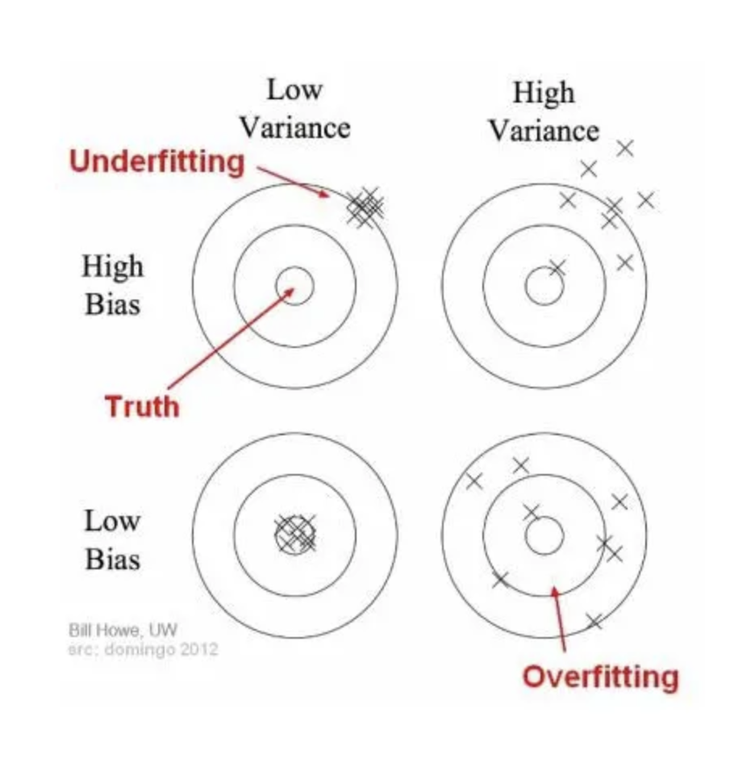
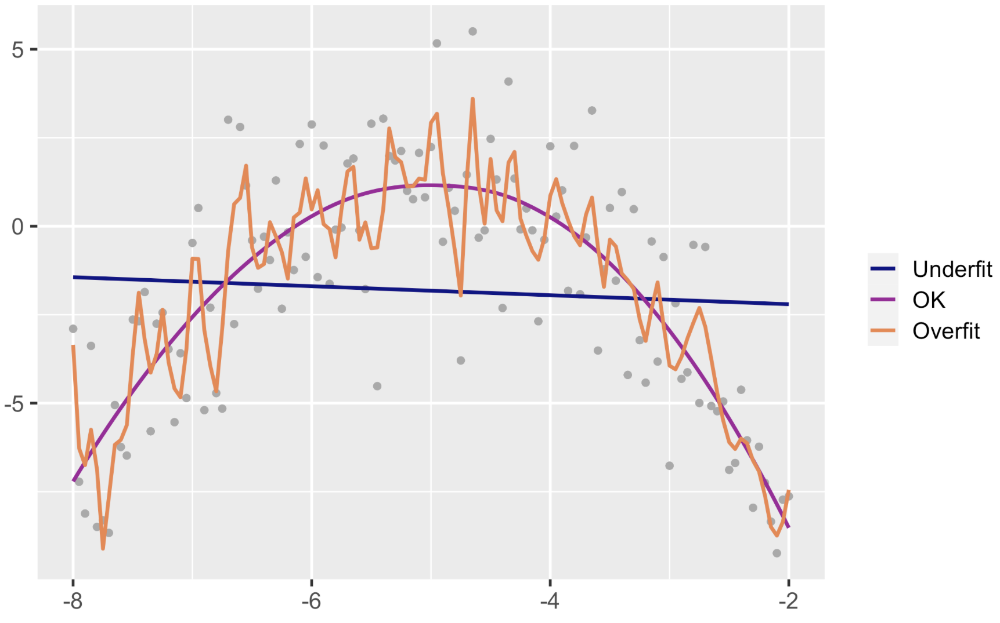
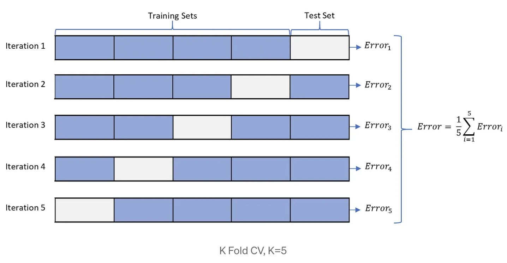

```{r echo=FALSE, message=FALSE, warning = FALSE}
library(tidyverse)
library(knitr)
library(RColorBrewer)
library(mosaic)
library(infer)


hook_output = knit_hooks$get('output')
knit_hooks$set(output = function(x, options) {
  # this hook is used only when the linewidth option is not NULL
  if (!is.null(n <- options$linewidth)) {
    x = xfun::split_lines(x)
    # any lines wider than n should be wrapped
    if (any(nchar(x) > n)) x = strwrap(x, width = n)
    x = paste(x, collapse = '\n')
  }
  hook_output(x, options)
})

```

## Announcements

**Lab 5**: work day in class on Thursday October 10

- Due Tuesday October 22nd, 2024 at 11:59 pm in Blueline

**Mini Project 2**

- Due Thursday October 24 at 11:59 in Blueline

---
### Statistical Models


There are two things we can do with fitting a model:
1. Interpretation 
2. Prediction

Last week we focused on interpretation, today we are going to talk about prediction.

--

Calculating a prediction is easy:

- Plug in values of predictors to the model equation
- Calculate the predicted value of the response variable, $(\hat{y})$

Getting a good prediction is hard:

- There is no guarantee the model estimates you have are correct
- Your model might not perform as well with new data as it did with your sample data

---
### No one best model

.center["All models are wrong, some are just useful"]

--

- Prediction Accuracy and Model Interpretability Trade-Off
  - A simple model is easier to interpret
  - A complicated model may have more accurate predictions
  
--

- Bias vs Variance Trade-Off
  - Models should minimize both bias and variance, but to some extent these are mutually exclusive goals.
  - A complicated models have less bias, but generally have higher variance (overfit).
  - A simple model can reduce variance but at the cost of increased bias (underfit).

---
##Bias vs Variance

```{r echo=FALSE, fig.align='center', out.width="70%"}

```


---
### Over vs Under Fitting

```{r echo=FALSE, fig.align='center'}

```

---
### Splitting Our Data

- Several steps to create a useful statistical model: parameter estimation, model selection, performance assessment, etc.

- Doing all of this on the entire data we have available can lead to overfitting
  + A model fits too well on the training data, not only fitting the true trend but also the noise in the training data.

- To avoid overfitting, we split the data.
  + Training: The set of data on which you build your model
  + Testing: After your model is built, this is the set used to test it by evaluating it against data that it has not previously seen.


---
### Let's return to our flight data

Consider a random sample of 1000 flights from NYC to Chicago in 2013. We want to create a model to predict arrival delay.

```{r, echo = FALSE, message=FALSE}
library(tidyverse)
library(nycflights13)
set.seed(14)
Chicago1000 <- flights %>%
  filter(dest %in% c('ORD', 'MDW'), !is.na(arr_delay)) %>% 
  sample_n(size=1000)
```


First we need to split it into a training and a testing set.

```{r}
set.seed(365)
test_id <- sample(1:nrow(Chicago1000), 
                  size=round(0.2*nrow(Chicago1000)))
TEST <- Chicago1000[test_id,]
TRAIN <- Chicago1000[-test_id,]
```

---
### Flight Data: Workflow

+ Fit model to Training set (let's start with interaction model):

```{r}
int = lm(arr_delay ~ hour + dep_delay + hour:dep_delay, 
         data = TRAIN)
```

+ Predict outcome on the Testing Set:

```{r}
predictions <- predict(int, TEST)
```

+ Evaluate Performance

  + Root Mean Square Error (RMSE) - for numerical response


---
### RMSE


$$\text{RMSE} = \sqrt{\frac{\sum^{n}_{i=1}(y_i - \hat{y}_i)^2}{n}}$$


- Most popular metric in the Regression setting
- Quantifies the extent to which the predicted value is close to the true response value for that observation

--

RMSE for Test Set:

```{r, message=FALSE}
#install.packages("Metrics")
library(Metrics)
rmse(TEST$arr_delay, predictions)
```


---
### Your Turn!

Find another model to predict `arr_delay`. Compare it's predictive accuracy to the previous model.


---
### Cross Validation

Potential Problem with a single split into training/testing: you evaluated the model only once and you are not sure your good result is by luck or not

- Want to evaluate model multiple times to be more confident in your model.
- Generally an issue with smaller data sets (probably not necessary with a large number of observations)

We can easily do this using cross validation 

- A resampling method that uses different portions of the data to test and train a model on different iterations
- Specifically going to focus on *k-fold cross validation*


---
### k-fold Cross Validation

Steps:

- Split the dataset into K subsets randomly
- Use K-1 subsets for training the model
- Test the model against that one subset that was left in the previous step
-  Repeat the above steps for K times i.e., until the model is not trained and tested on all subsets
- Generate overall prediction error by taking the average of prediction errors in every case

```{r echo=FALSE, fig.align='center', out.width="80%"}

```

---
### k-fold Cross Validation

What should you choose for *k*?

- Generally choose *k* = 5 or *k* = 10. 

  + Large *k* is very computationally expensive and has lots of variability
  + Small *k* can lead to a biased model

---
### k-fold Cross Validation

```{r, message=FALSE}
library(caret)
train_control <- trainControl(method = "cv", 
                              number = 5)

model <- train(arr_delay ~ hour + dep_delay + hour:dep_delay, 
               data = Chicago1000, trControl = train_control, 
               method = "lm")
model
```


---
### k-fold Cross Validation

Linear Regression does not have hyperparameters (parameters of the model that cannot be directly learned from the data)

If you were working with a model with hyperparameters (we'll work with some later), best to do it this way:


```{r echo=FALSE, fig.align='center', out.width="80%"}
knitr::include_graphics("../../Week 8/slides/images/k-fold-cv2.png")
```


---
### Your Turn!

Try k-fold Cross Validation on your model! How does your results change as you change $k$?


---
### Caution with Linear Models: Extrapolation

We extrapolate when we use the regression equation to produce a response value from an x-value that is outside the range of the observed x-values

Let's look at the visualization of the relationship between year and diameter of a dinner plate.

```{r echo=FALSE, fig.align='center', out.width="40%"}
knitr::include_graphics("../../Week 8/slides/images/extrapolation.png")
```

The trend in the data as summarized by the estimated regression equation does not necessarily hold outside the scope of the model. If so, dinner plates would constantly be getting bigger. 


