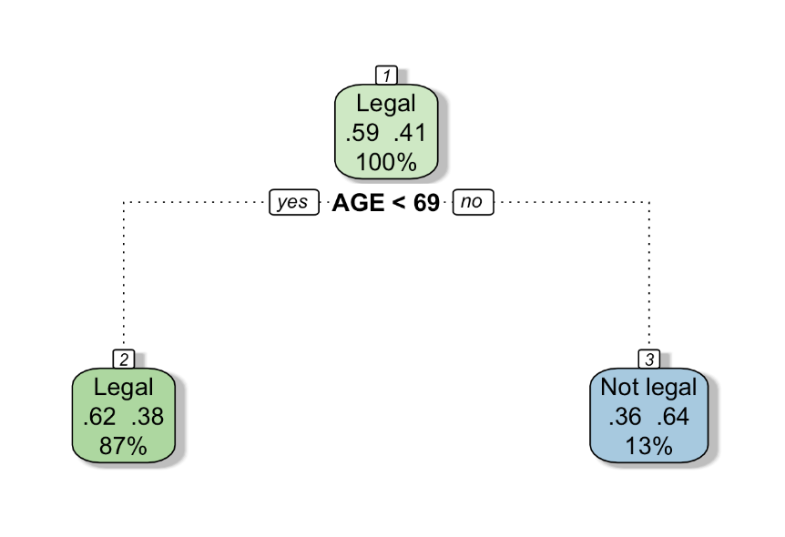
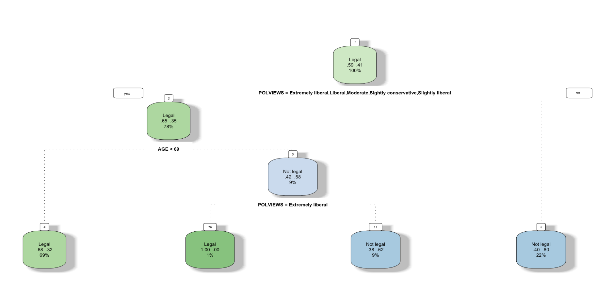

```{r echo=FALSE, message=FALSE, warning = FALSE}
library(tidyverse)
library(knitr)
library(mosaic)
library(infer)
library(caret)


hook_output = knit_hooks$get('output')
knit_hooks$set(output = function(x, options) {
  # this hook is used only when the linewidth option is not NULL
  if (!is.null(n <- options$linewidth)) {
    x = xfun::split_lines(x)
    # any lines wider than n should be wrapped
    if (any(nchar(x) > n)) x = strwrap(x, width = n)
    x = paste(x, collapse = '\n')
  }
  hook_output(x, options)
})

```

```{css, echo = FALSE}
.tiny .remark-code { /*Change made here*/
  font-size: 70% !important;
}
```

## Agenda

- Prediction
  - Evaluating Models
- Decision Trees
- Random Forests

---
## Announcements

- **Lab 5** due tonight at 11:59 pm
- **Mini-Project 2** due tonight at 11:59 pm

---

## Statistical learning and Machine learning

The difference between two concepts are subjective. Both of the terms emphasize prediction more than interpretation and both of the terms involves using algorithms and statistical models to analyze and draw inferences from patterns in data.

---
## Supervised vs Unsupervised Learning

Learning techniques fall into two categories:

1. Supervised learning: Use input data (predictors) to predict the value of an output data (response variable). If the output data is continuous, we call it regression. If the output data is categorical, we call it classification.
  -  You’re familiar with some (simple) supervised learning techniques already: like a linear model: y ~ x1 + x2 + x3
2. Unsupervised learning: There is no response variable. We try to learn the pattern of the input data, usually by clustering them into several groups.

--

$\\$

.center[
What is the difference between classification and clustering?
]

---
## Evaluating Models

1. Bias-variance trade-off
2. Prediction Accuracy

---
## Bias-variance trade-off

Models should minimize both bias and variance, but to some extent these are mutually exclusive goals. 
  - A complicated models have less bias, but generally have higher variance. 
  - A simple model can reduce variance but at the cost of increased bias. 

Also tends to be a trade-off between prediction accuracy and model complexity

---
## Cross-Validation

In predictive analytics, data sets are often divided into two sets:
- Training: The set of data on which you build your model
- Testing: After your model is built, this is the set used to test it by evaluating it against data that it has not previously seen.

One concern in model fitting is overfitting: A model fits too well on the training data, not only fitting the true trend but also the noise in the training data.
- To avoid overfitting, we cross-validate by splitting the data.

--
$\\$
.center[
How many observations should go in the test v. training data set?
]

---
## Cross-Validation

Cross-validation is a resampling method that uses different portions of the data to test and train a model on different iterations

Two main steps: 

- splitting the data into subsets (called folds)
- rotating the training and validation among them

--

```{r, echo=FALSE, fig.align='center',out.width="65%"}

knitr::include_graphics("../Week 8/cv.png")

```

---
## Prediction with Linear Regression

Let's return to our flight data real quick. We can create a training and testing data set.

```{r}
library(nycflights13)
data("flights")
set.seed(14)
Chicago1000 <- flights %>%
  filter(dest %in% c('ORD', 'MDW'), !is.na(arr_delay)) %>% 
  sample_n(size=1000)

#Define our Training and Testing Sets
set.seed(365)
test_id <- sample(1:nrow(Chicago1000), 
                  size=round(0.4*nrow(Chicago1000)))
TEST <- Chicago1000[test_id,]
TRAIN <- Chicago1000[-test_id,]
```

---
## Prediction with Linear Regression

Root Mean Square Error (RMSE) = $$ \sqrt{\frac{\sum^n_i(y_i - \hat{y})^2}{n}}  $$

```{r}
int = lm(arr_delay ~ hour + dep_delay + hour:dep_delay, 
         data = TRAIN)

#RMSE for Training Data
sqrt(mean(int$residuals^2))

#install.packages("Metrics")
library(Metrics)
#RMSE for Testing Data
rmse(TEST$arr_delay, predict(int, TEST))

```

[Cross Validation with Linear Regression](https://www.geeksforgeeks.org/cross-validation-in-r-programming/)
---
## Classification Methods

.center[
Whereas regression models have a quantitative response variable (and can thus often be visualized as a geometric surface), classification models have a categorical response (and are often visualized as a discrete surface, i.e., a tree).
]

---
## Example: Marijuana legalization

The General Social Survey is a wide-ranging survey conducted biannually to measure cultural shifts in American society. We can use the GSS to get an idea of how popular opinion has changed.

.tiny[
```{r}
GSS <- read.csv("../Week 8/GSS2016.csv")
glimpse(GSS)
```
]

---
## Let's Clean Our Data! Yay!

- Let's only look at one year, say 2016, and remove "Not applicable from our response"

```{r}
GSS <- GSS %>% filter(YEAR==2016) %>% 
  filter(GRASS != 'Not applicable')
```

- Want just two groups for responses: Legal and Not legal

```{r}
GSS <- GSS %>%
mutate(LEGAL = ifelse(GRASS=='Legal', 'Legal', 'Not legal'))

```

- Change variables to proper type

```{r}
GSS$AGE <- as.numeric(GSS$AGE)
```

---
## Cleaned Data

.tiny[
```{r}
head(GSS)
```
]

---
## Testing data v. training data

**Goal**: Use Age to predict people’s opinion of marijuana legalization.

```{r}
set.seed(365)
test_id <- sample(1:nrow(GSS), size=round(0.4*nrow(GSS)))
TEST <- GSS[test_id,]
TRAIN <- GSS[-test_id,]
```

--

How many people in the training data set support marijuana legalization?

```{r}
TRAIN %>% group_by(LEGAL) %>% summarize(n=n())
```


---
## Decision Trees

Decision trees: A tree-like model of decisions and their possible consequences

- Has flowchart-like structure in which each...
  + Internal node represents a "test" on an attribute (decision node), 
  - Branch represents the outcome of the test, 
  - Leaf node represents a class label (decision taken after computing all attributes). 
- The paths from root to leaf represent classification rules.
- Can be applied on both regression and classification problems.

```{r, echo=FALSE, fig.align='center',out.width="75%"}

knitr::include_graphics("../Week 8/decision-tree.png")

```


---
## Fitting A Decision Tree

```{r}
#install.packages('rpart')
library(rpart)
rpart(LEGAL~AGE, data=TRAIN, na.action = na.pass)
```

---
### Visualizing a Decision Tree

```{r, message=FALSE, fig.height=8, fig.width=10, eval = FALSE}
#install.packages("rattle")
library(rattle)
tree <- rpart(LEGAL~AGE, data=TRAIN, na.action = na.pass)
fancyRpartPlot(tree)
```

```{r, echo=FALSE, fig.align='center',out.width="75%"}



```

---
### Visualizing using ggplot

```{r, warning=FALSE, fig.height=6, fig.width=8, fig.align='center'}
TRAIN %>% ggplot(aes(x=LEGAL, y=AGE)) + 
  geom_hline(yintercept=69, col='black') + 
  geom_jitter(alpha=0.5, aes(col=LEGAL))
```

---
### Visualizing using ggplot

```{r, warning=FALSE, fig.height=6, fig.width=8, fig.align='center'}
TRAIN %>% ggplot(aes(x=LEGAL, y=AGE)) +
geom_boxplot(aes(col=LEGAL))
```


---
### Try Yourself

Remember we said earlier decision trees can also use to do the prediction when response variable is a continuous variable. Let’s see how it works. Suppose you want to use people’s political view (POLVIEWS) and marriage status (MARITAL) to estimate
people’s age. Try to plot and tree and also make a side-by-side scatter plot.

--

```{r, eval = FALSE}
tree2 <- rpart(AGE~POLVIEWS + MARITAL, data=TRAIN)
fancyRpartPlot(tree2)
```

```{r, echo=FALSE, fig.align='center',out.width="75%"}

knitr::include_graphics("../Week 8/tree2.png")

```
---
### Try Yourself

```{r, warning=FALSE, fig.height=6, fig.width=8, fig.align='center'}
TRAIN %>% ggplot(aes(x=MARITAL, y=AGE)) +
  geom_jitter(alpha=0.5, aes(col=MARITAL)) +
  geom_hline(yintercept=c(36, 52, 69), col='black')
```

---
## Evaluating a decision tree: the three C’s

- Complexity parameter
- Confusion Matrix
- Classification Accuracy

---
### Complexity parameter

It is the amount by which splitting that node improved the relative error.
  - So splitting that node only resulted in an improvement of 0.01, so the tree building stopped there

.tiny[
```{r, message=FALSE}
printcp(tree)
```
]

---
### Confusion Matrix

```{r}
TRAIN <- TRAIN %>%
  mutate(Legal_Tree = predict(tree, type='class'))

confusion_train <- tally(Legal_Tree~LEGAL, data=TRAIN)
confusion_train
```

```{r}
TEST <- TEST %>%
  mutate(Legal_Tree = predict(tree, type='class', newdata = TEST))

confusion_test <- tally(Legal_Tree~LEGAL, data=TEST)
confusion_test
```

---
### Classification Accuracy

Training Accuracy:

```{r}
sum(diag(confusion_train))/nrow(TRAIN)
```

Testing Accuracy:

```{r}
sum(diag(confusion_test))/nrow(TEST)
```

---
### Prediction for Decision Regression Tree

Going Back to the Try it yourself example, we can still use the predict function to predict our regression decision tree outputs.

```{r}
TEST <- TEST %>% filter(MARITAL != "No answer") 

predict(tree2, TEST , method = "anova") %>% head()
```

<br>

**Be Careful**: Can only predict using categorical variables located in the Training Set

---
### Try by Yourself

What if we try to use both age and political affiliation to predict the view on marijuana legalization? Visualize the tree and calculate the classification accuracy.

--

```{r, eval = FALSE}
tree3 <- rpart(LEGAL~AGE+PARTYID, data=TRAIN)
fancyRpartPlot(tree3)
```

```{r, echo=FALSE, fig.align='center'}

knitr::include_graphics("../Week 8/tree3.png")

```

---
### Try by Yourself

```{r}
TRAIN <- TRAIN %>%
  mutate(Legal_Tree = predict(tree3, type='class'))

confusion_train <- tally(Legal_Tree~LEGAL, data=TRAIN)
```

```{r}
TEST <- TEST %>%
  mutate(Legal_Tree = predict(tree3, type='class', newdata = TEST))

confusion_test <- tally(Legal_Tree~LEGAL, data=TEST)
```

Training Accuracy:

```{r}
sum(diag(confusion_train))/nrow(TRAIN)
```

Testing Accuracy:

```{r}
sum(diag(confusion_test))/nrow(TEST)
```

---
### Advantages and Disadvantages of Decision Trees

- Easy to explain to people
  + Can visualize
  + Some people believe that it mirrors human decision-making
- Can handle qualitative predictors with dummy variables
- However, they generally do not have the same level of predictive accuracy as other approaches
  + Can approve prediction accuracy by aggregating many trees!
  
  
  
---
### Random Forests

A random forest is collection of decision trees that are aggregated by majority rule

Random forest will expect you to have a relatively large number of input variables.

**Example**: Which variables are most important for predicting views on marijuana legalization?

---
### When to use random forest

1. When there are a lot of variables and you have no idea why one may be useful to explain the response variable.

2. Potential collinearity in the predictors.

Once the random forest tells you several potential important variables, you can try to fit linear model or decision tree for interpretation

---
## Random Forests

.tiny[
```{r}
#install.packages('randomForest')
library(randomForest)

forest_grass <- randomForest(as.factor(LEGAL)~NEWSFROM+HAPPY+
                               RELIG+COURTS+ENERGY+EDUC+ENVIR+
                               POLVIEWS+PARTYID+REGION+INCOME+
                               SEX+DEGREE+AGE+MARITAL+BALLOT, 
                             data=TRAIN, na.action = na.omit,
                             ntree=201, mtry=4)

forest_grass
```
]
---
## Random Forests: Prediction

```{r}
TEST <- TEST %>%
  mutate(Legal_RF = predict(forest_grass, type='class', 
                            newdata = TEST)) 

TEST$Legal_RF[1:5]
```

---
### Variable Importance

Since each tree in a random forest uses a different set of variables, we want to keep track of which variables seem to be the most consistently influential. This is captured by the notion of importance.

Gini is a measure of how each variable contributes to the homogeneity of the nodes and leaves in the resulting random forest (lower is more pure).

.tiny[
```{r}
importance(forest_grass) %>% as.data.frame() %>% 
  rownames_to_column() %>% arrange(desc(MeanDecreaseGini))
```
]


---
### Decision Tree with Selected Importance

```{r, eval = FALSE}
tree4 <- rpart(LEGAL~AGE+REGION+POLVIEWS, data=TRAIN)
fancyRpartPlot(tree4)
```

```{r, echo=FALSE, fig.align='center'}



```

---
### Your Turn: Age

Which variables are most important for predicting ages? Use these to create a Decision Tree.

--
```{r}
forest_age <- randomForest(AGE~NEWSFROM+ HAPPY+RELIG+COURTS+ENERGY
                           +EDUC+ENVIR+ POLVIEWS+PARTYID+REGION+
                             INCOME+SEX+ DEGREE+LEGAL+MARITAL+BALLOT, 
                           data=TRAIN,
                           ntree=201, mtry=3, na.action = na.omit)

forest_age
```

---
### Your Turn: Age


```{r}
importance(forest_age) %>% as.data.frame() %>%
  rownames_to_column() %>% arrange(desc(IncNodePurity))

tree5 <- rpart(AGE~MARITAL+REGION+POLVIEWS, data=TRAIN)
```


---
### If Time: Iris Data

Here is the data from credit card customers. One variable that credit card companies are often interested in is utilization: how much of the available credit limit is currently being “used”?

```{r}
data("iris")
```

1. Separate into training and testing set
2. Fit a random Forest Model (Species)- Decide variable importance
3. Using your most important variables, create a decision tree
4. Evaluate your decision Tree


---
### If Time: Iris Data

```{r}
set.seed(10)
test_id <- sample(1:nrow(iris), size=round(0.4*nrow(iris)))
TEST <- iris[test_id,]
TRAIN <- iris[-test_id,]
```

.tiny[
```{r}
forest_species <- randomForest(Species~Sepal.Length + Sepal.Width+ 
                                 Petal.Length+Petal.Width, data=TRAIN,
                               ntree=50, mtry=2, na.action =na.omit)

forest_species
```
]

---
### If Time: Iris Data

```{r}
importance(forest_species) %>% as.data.frame() %>%
  rownames_to_column() %>% arrange(desc(MeanDecreaseGini))

tree6 <- rpart(Species ~ Petal.Width + Petal.Length, data=TRAIN)

```

---
### If Time: Iris Data

```{r, eval = FALSE}
fancyRpartPlot(tree6)
```

```{r, echo=FALSE, fig.align='center'}

knitr::include_graphics("../Week 8/tree6.png")

```

---
### If Time: Iris Data

```{r}
TRAIN <- TRAIN %>%
  mutate(Species_Tree = predict(tree6, type='class'))

confusion_train <- tally(Species_Tree~Species, data=TRAIN)
```

```{r}
TEST <- TEST %>%
  mutate(Species_Tree = predict(tree6, type='class', newdata = TEST))

confusion_test <- tally(Species_Tree~Species, data=TEST)
```

Training Accuracy:

```{r}
sum(diag(confusion_train))/nrow(TRAIN)
```

Testing Accuracy:

```{r}
sum(diag(confusion_test))/nrow(TEST)
```