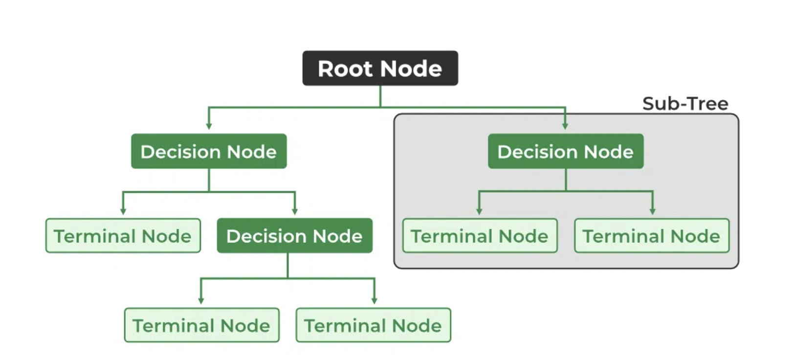

```{r echo=FALSE, message=FALSE, warning = FALSE}
library(tidyverse)
library(knitr)
library(mosaic)
library(infer)
library(caret)


hook_output = knit_hooks$get('output')
knit_hooks$set(output = function(x, options) {
  # this hook is used only when the linewidth option is not NULL
  if (!is.null(n <- options$linewidth)) {
    x = xfun::split_lines(x)
    # any lines wider than n should be wrapped
    if (any(nchar(x) > n)) x = strwrap(x, width = n)
    x = paste(x, collapse = '\n')
  }
  hook_output(x, options)
})

```

```{css, echo = FALSE}
.tiny .remark-code { /*Change made here*/
  font-size: 70% !important;
}
```

## Announcements

**Lab 5**: Due Tuesday October 22nd, 2024 at 11:59 pm in Blueline

**Mini Project 2**

- Due Thursday October 24 at 11:59 in Blueline

**Lab 6**: work day in class on Thursday October 24

- Due Tuesday October 29th, 2024 at 11:59 pm in Blueline

---
## Supervised vs Unsupervised Learning

Learning techniques fall into two categories:

1. Supervised learning: Use input data (predictors) to predict the value of an output data (response variable). If the output data is continuous, we call it regression. If the output data is categorical, we call it classification.
  -  You’re familiar with some (simple) supervised learning techniques already: like a linear model: y ~ x1 + x2 + x3
2. Unsupervised learning: There is no response variable. We try to learn the pattern of the input data, usually by clustering them into several groups.


---
## Tree-Based Methods

- Can be used for both regression and classification
  + Regression models have a quantitative response variable (and can thus often be visualized as a geometric surface) 
  + Classification models have a categorical response (and are often visualized as a discrete surface).
- These involve stratifying or segmenting the predictor space into a number of simple regions
  + Have a set of decision rules that can be summarized in a tree


---
### Example: Marijuana legalization

The General Social Survey is a wide-ranging survey conducted biannually to measure cultural shifts in American society. We can use the GSS to get an idea of how popular opinion has changed.

.tiny[
```{r, eval = FALSE}
GSS <- read.csv("GSS2016.csv")
glimpse(GSS)
```

```{r, echo = FALSE}
GSS <- read.csv("../../Week 9/slides/GSS2016.csv")
glimpse(GSS)
```
]

---
## Let's Clean Our Data! Yay!

- Let's only look at one year, say 2016, and remove "Not applicable from our response"

```{r}
GSS <- GSS %>% filter(YEAR==2016) %>% 
  filter(GRASS != 'Not applicable')
```

- Want just two groups for responses: Legal and Not legal

```{r}
GSS <- GSS %>%
mutate(LEGAL = ifelse(GRASS=='Legal', 'Legal', 'Not legal'))

```

- Change variables to proper type

```{r}
GSS$AGE <- as.numeric(GSS$AGE)
```

---
## Testing data v. training data

**Goal**: Use Age to predict people’s opinion of marijuana legalization.

```{r}
set.seed(4)
test_id <- sample(1:nrow(GSS), size=round(0.2*nrow(GSS)))
TEST <- GSS[test_id,]
TRAIN <- GSS[-test_id,]
```

--

How many people in the training data set support marijuana legalization?

```{r}
TRAIN %>% group_by(LEGAL) %>% summarize(n=n())
```


---
## Decision Trees

Decision trees: A tree-like model of decisions and their possible consequences

- Has flowchart-like structure in which each...
  + Internal node represents a "test" on an attribute (decision node), 
  - Branch represents the outcome of the test, 
  - Leaf node represents a class label (decision taken after computing all attributes). 
- The paths from root to leaf represent classification rules.
- Can be applied on both regression and classification problems.

```{r, echo=FALSE, fig.align='center',out.width="75%"}



```

---
## Decision Trees (Classification)

We first divide the predictor space into *J* distinct non-overlapping regions. We predict that each observation belongs to the most commonly occurring class of training observations in the region to which it belongs.

--

How to decide to split?

- As the number of predictors increases, so does the number of possible trees.
  + Optimal decision trees do not exist (Hyafil & Rivest, 1976)
  + So several competing methods for building decision trees

---
## Decision Trees (Classification)

Recursive Partitioning: Split an infinite # of times until some stopping criterion is reached.

Split:
  + Gini Index (default): $$G = \sum^{K}_{k=1}\hat{p}_{mk}(1-\hat{p}_{mk})$$
where $\hat{p}_{mk}$ is the proportion of training observations in the *m*th region that are from the *k*th class
    + Gini Index is a measure of node purity
    
    
Stop:

- Complexity parameter: Prunes splits that don't sufficiently improve a model's predictive power

  
---
## Fitting A Decision Tree (Classification)

```{r}
#install.packages('rpart')
library(rpart)
rpart(LEGAL~AGE, data=TRAIN, na.action = na.pass)
```

---
### Visualizing a Decision Tree (Classification)

```{r, message=FALSE, fig.height=8, fig.width=10, eval = FALSE}
#install.packages("rattle")
library(rattle)
tree <- rpart(LEGAL~AGE, data=TRAIN, na.action = na.pass)
fancyRpartPlot(tree)
```


```{r, echo = FALSE}
tree <- rpart(LEGAL~AGE, data=TRAIN, na.action = na.pass)

```

```{r, echo=FALSE, fig.align='center',out.width="75%"}

knitr::include_graphics("../../Week 9/slides/images/tree1.png")

```

---
### Visualizing using ggplot

```{r, warning=FALSE, fig.height=6, fig.width=8, fig.align='center'}
TRAIN %>% ggplot(aes(x=LEGAL, y=AGE)) + 
  geom_hline(yintercept=69, col='black') + 
  geom_jitter(alpha=0.5, aes(col=LEGAL))
```

---
### Visualizing using ggplot

```{r, warning=FALSE, fig.height=6, fig.width=8, fig.align='center'}
TRAIN %>% ggplot(aes(x=LEGAL, y=AGE)) +
geom_boxplot(aes(col=LEGAL))
```

---
## Evaluating a decision tree

- Confusion Matrix
- Classification Accuracy
---
### Confusion Matrix

```{r}
TRAIN <- TRAIN %>%
  mutate(Legal_Tree = predict(tree, type='class'))

confusion_train <- tally(Legal_Tree~LEGAL, data=TRAIN)
confusion_train
```

```{r}
TEST <- TEST %>%
  mutate(Legal_Tree = predict(tree, type='class', newdata = TEST))

confusion_test <- tally(Legal_Tree~LEGAL, data=TEST)
confusion_test
```

---
### Classification Accuracy

Training Accuracy:

```{r}
sum(diag(confusion_train))/nrow(TRAIN)
```

Testing Accuracy:

```{r}
sum(diag(confusion_test))/nrow(TEST)
```


---
## Tuning Parameter: Complexity parameter

Using recursive paritioning can overfit the training data - Prune Tree 

.tiny[
```{r, message=FALSE}
printcp(tree)
```
]

- Change CP (Example)

```{r, eval = FALSE}
rpart(LEGAL~AGE, data=TRAIN, na.action = na.pass,
      control = rpart.control(cp = 0.05))

```


---
## Decision Trees (Regression)

We first divide the predictor space into *J* distinct non-overlapping regions. Then for every observation that falls into the region $R_j$, we make the same prediction, which is simply the mean of the response values for the training observations in $R_j$.


--

<br>

How to decide to split?

- Find regions $(R_j)$ that minimizes the residual sum of squares $$RSS = \sum^{J}_{j=1}\sum_{i \in R_j}(y_i - \hat{y}_{R_j})^2)$$. 

  - Stops when you reach some criterion (cp).


---
### Fitting A Decision Tree (Regression)

Let's suppose we want to use people’s political view (POLVIEWS) and marital status (MARITAL) to estimate people’s age.

```{r, eval = FALSE}
tree2 <- rpart(AGE~POLVIEWS+MARITAL, data=TRAIN)
fancyRpartPlot(tree2)
```

```{r, echo = FALSE}
tree2 <- rpart(AGE~POLVIEWS + MARITAL, data=TRAIN)
```

```{r, echo=FALSE, fig.align='center',out.width="75%"}

knitr::include_graphics("../../Week 9/slides/images/tree2.png")

```

---
### Prediction for Decision Regression Tree

We can still use the predict function to predict our regression decision tree outputs. Can then find the RMSE using these predictions. Can also print out the complexity parameter information to assess fit.

```{r}
TEST <- TEST %>% filter(MARITAL != "No answer") 

predict(tree2, TEST , method = "anova") %>% head()
```

<br>

**Be Careful**: Can only predict using categorical variables located in the Training Set

---
### Try by Yourself

What if we try to use both age and political affiliation to predict the view on marijuana legalization? Visualize the tree and calculate the classification accuracy.


---
### Trees Versus Linear Models

- If the relationship between the features and the response is well approximated by
a linear model: 
  + linear regression (exploits linear structure). 
- If instead there is a highly nonlinear and complex relationship between the features and the response as indicated by model: 
  + decision trees

<br>

**But should also consider other things like testing error and interpretability**

---
### Advantages and Disadvantages of Decision Trees

- Easy to explain to people
  + Can visualize
  + Mirrors human decision-making
- Can handle qualitative predictors with dummy variables
- However, they generally do not have the same level of predictive accuracy as other approaches
  + Can approve prediction accuracy by aggregating many trees!
  
  
  
---
### Random Forests

A random forest is collection of decision trees that are aggregated by majority rule

  - Random forest will expect you to have a relatively large number of input variables.

<br>

When to use random forest

  - When there are a lot of variables and you have no idea why one may be useful to explain the response variable.
  - Potential collinearity in the predictors.

---
## Building a Random Forest

In building a random forest, each time a split in a tree is considered, a random sample of *m* predictors is chosen as split candidates from the full set of *p* predictors. 

- A fresh sample of *m* predictors is taken at each split
- Typically we choose *m* $\approx \sqrt{p}$ 

Hence, at each split in the tree, the algorithm is not even allowed to consider a majority of the available predictors. Why is this a good thing?

---
## Random Forests 

**Example**: Which variables are most important for predicting views on marijuana legalization?


.tiny[
```{r, message=FALSE}
#install.packages('randomForest')
library(randomForest)

forest_grass <- randomForest(as.factor(LEGAL)~NEWSFROM+HAPPY+
                               RELIG+COURTS+ENERGY+EDUC+ENVIR+
                               POLVIEWS+PARTYID+REGION+INCOME+
                               SEX+DEGREE+AGE+MARITAL+BALLOT, 
                             data=TRAIN, na.action = na.omit,
                             ntree=201, mtry=4)

forest_grass
```
]

---
## Random Forests: Prediction

```{r}
TEST <- TEST %>%
  mutate(Legal_RF = predict(forest_grass, type='class', 
                            newdata = TEST)) 

TEST$Legal_RF[1:5]

confusion_test <- tally(Legal_RF~LEGAL, data=TEST)
sum(diag(confusion_test))/nrow(TEST)
```

---
### Variable Importance

Since each tree in a random forest uses a different set of variables, we want to keep track of which variables seem to be the most consistently influential. 

.tiny[
```{r}
randomForest::importance(forest_grass) %>% as.data.frame() %>% 
  rownames_to_column() %>% arrange(desc(MeanDecreaseGini))
```
]


---
### Decision Tree with Selected Importance

```{r, eval = FALSE}
tree4 <- rpart(LEGAL~AGE+REGION+POLVIEWS, data=TRAIN)
fancyRpartPlot(tree4)
```

```{r, echo = FALSE}
tree4 <- rpart(LEGAL~AGE+PARTYID, data=TRAIN)
```

```{r, echo=FALSE, fig.align='center'}

knitr::include_graphics("../../Week 9/slides/images/tree4.png")

```

---
### Your Turn: Age

Which variables are most important for predicting `Age`? Use these to create a Decision Tree. Note: Check column name when you arrange the importance variables.


---
### If Time: Iris Data

Here is the data from credit card customers. One variable that credit card companies are often interested in is utilization: how much of the available credit limit is currently being “used”?

```{r}
data("iris")
```

1. Separate into training and testing set
2. Fit a random Forest Model (Species)- Decide variable importance
3. Using your most important variables, create a decision tree
4. Evaluate your decision Tree

