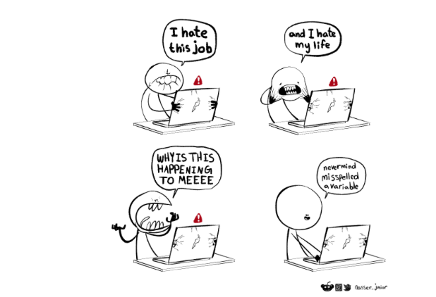

```{r echo=FALSE, message=FALSE, warning = FALSE}
library(tidyverse)
library(knitr)

hook_output = knit_hooks$get('output')
knit_hooks$set(output = function(x, options) {
  # this hook is used only when the linewidth option is not NULL
  if (!is.null(n <- options$linewidth)) {
    x = xfun::split_lines(x)
    # any lines wider than n should be wrapped
    if (any(nchar(x) > n)) x = strwrap(x, width = n)
    x = paste(x, collapse = '\n')
  }
  hook_output(x, options)
})

```

```{r, include = F, eval = T, cache = T}
clean_file_name <- function(x) {
  basename(x) %>% str_remove("\\..*?$") %>% str_remove_all("[^[A-z0-9_]]")
}

img_modal <- function(src, alt = "", id = clean_file_name(src), other = "") {
  
  other_arg <- paste0("'", as.character(other), "'") %>%
    paste(names(other), ., sep = "=") %>%
    paste(collapse = " ")
  
  js <- glue::glue("<script>
        /* Get the modal*/
          var modal{id} = document.getElementById('modal{id}');
        /* Get the image and insert it inside the modal - use its 'alt' text as a caption*/
        var img{id} = document.getElementById('img{id}');
          var modalImg{id} = document.getElementById('imgmodal{id}');
          var captionText{id} = document.getElementById('caption{id}');
          img{id}.onclick = function(){{
            modal{id}.style.display = 'block';
            modalImg{id}.src = this.src;
            captionText{id}.innerHTML = this.alt;
          }}
          /* When the user clicks on the modalImg, close it*/
          modalImg{id}.onclick = function() {{
            modal{id}.style.display = 'none';
          }}
</script>")
  
  html <- glue::glue(
     " <!-- Trigger the Modal -->

<!-- The Modal -->
<div id='modal{id}' class='modal'>
  <!-- Modal Content (The Image) -->
  
  <!-- Modal Caption (Image Text) -->
  <div id='caption{id}' class='modal-caption'></div>
</div>
"
  )
  write(js, file = "js-addins.html", append = T)
  return(html)
}
# Clean the file out at the start of the compilation
write("", file = "js-addins.html")
```
<!-- class:inverse -->

<!-- <br><br><br> -->
<!-- ## DSC365: Intro to Data Science -->
<!-- ### Introduction to R -->
<!-- #### August 22, 2024 -->

---
## Agenda

- R Studio Set-Up
- R as a Calculator
- Basic Functions
- Installing Packages
- Loading Data

<br>
<br>

**Note**: Please follow along and run the code in the file *IntroR.R* found in BlueLine

---
### R Studio Set-Up

```{r, echo=FALSE, out.width="100%", fig.align='center'}

knitr::include_graphics("images/rstudio.png")

```

To Create a Script, Click the Following: File -> New File -> R script

[R Studio IDE Cheatsheet](../cheatsheets/rstudio-ide.pdf)

---
### R Studio Set-Up - Editor (Top Left)

```{r, echo=FALSE, out.width="100%", fig.align='center'}

knitr::include_graphics("images/editor.jpeg")

```
<br>
**Shortcuts for running code**: To run code from your script:
+ Windows: Ctrl + Enter
+ Mac: Cmd + Enter

---
### R Studio Set-Up - Console (Bottom Left)

```{r, echo=FALSE, out.width="100%", fig.align='center'}

knitr::include_graphics("images/console.jpeg")

```

---
### R Studio Set-Up - Environment  (Top Right)

```{r, echo=FALSE, out.width="100%", fig.align='center'}

knitr::include_graphics("images/environment.jpeg")

```

---
### R Studio Set-Up - Environment  (Bottom Right)

```{r, results='asis', echo=FALSE, fig.align='center'}

i1 <- img_modal(src = "images/files.png", alt = "Files",other=list(width="30%"))
i2 <- img_modal(src = "images/packages.png", alt = "Packages",other=list(width="30%"))
i3 <- img_modal(src = "images/help.png", alt = "Help",other=list(width="30%"))

c(str_split(i1, "\\n", simplify = T)[1:2],
  str_split(i2, "\\n", simplify = T)[1:2],
  str_split(i3, "\\n", simplify = T)[1:2],
  str_split(i1, "\\n", simplify = T)[3:9],
  str_split(i2, "\\n", simplify = T)[3:9],
  str_split(i3, "\\n", simplify = T)[3:9]
  ) %>% paste(collapse = "\n") %>% cat()

```


---
## Writing Code for People

-  A **comment** is a part of computer code which is intended only for people to read. It is not evaluated or run by the computing language. 
  - In `R` we use `#`
```{r}
# This is a comment
```
-  **Literate Programming**: interspersing text and code in the same document
  - We will learn more about this next week.
---

## Giant Calculator!

.pull-left[
```{r}
3+4 #Addition
5-2 #Subtraction
3*2 #Multiplication
9/3 #Division 
```
].pull-right[
```{r}
sqrt(4)
2^3
exp(3)
log(10)
```
]

[Basics Cheatsheets](https://iqss.github.io/dss-workshops/R/Rintro/base-r-cheat-sheet.pdf)

---

## Giant Calculator!

.pull-left[
```{r}
log(10, base = 10)
abs(-1)
floor(3.7)
ceiling(3.2)
```
].pull-right[
```{r}
pi
sin(pi/2)
5%%3 #division remainder
```
]

---

## Giant Calculator!

```{r}
a <- 2
b <- 4
c <- 3
```


**Note**: In R, the following will not work!
```{r eval = FALSE}

b(a+c)
```
*R* will assume the "b()" is indicating some function, NOT multiplication as we do in math and stats. 

Thus, you MUST include the multiplication symbol.
```{r}
b*(a+c)
```

---

## Creating Variables

We can create variables using the assignment operator `<-`  
(that's typed as `<` `-` with no space)

```{r}
x <- 5
```

We can then perform any of the functions on the variables:

```{r}
log(x)
```

Rules of Naming Variables:
+ Variables can't start with a number
+ Case-sensitive
+ There are reserved words that *R* won't let you use for variables names
  - for, in, while, if, else, repeat, break, next

---
## Vectors

A variable does not need to be a single value. We can create a **vector** using the `c` function (combine- combines several objects into one)

```{r}
y <- c(1, 5, 3, 2)
```


Operations can then be done element-wise

```{r}
y/2
```

Determining number of objects in a vector

```{r}
length(y)
```

---
## Vectors

Can also have vectors of characters

```{r}
bulldogs <- c("american", "english", "french")
bulldogs
```


```{r}
length(bulldogs)
       
str(bulldogs)
```

---

## Logical Values

```{r}
a <- 4
a==5

a <= 5
a !=5
```

---

## Getting Help

Let's talk about a couple ways to get help. The primary function to use is the `help` function. Just pass in the name of the function you need help with:

```{r eval = FALSE}
help(head)
```

The `?` also works
```{r eval = FALSE}
?head
```

This returns the help documentation for this function

Googling for help can be difficult at first. You might need to search for R + CRAN +  to get good results

Stackoverflow is VERY helpful!

[R Reference Card](https://cran.r-project.org/doc/contrib/Short-refcard.pdf)

---
## R Packages

- **Packages** are the fundamental units of reproducible R code. They include reusable R functions, the documentation that describes how to use them, and sample data.
- Commonly used *R* function are installed with base *R*
- *R* packages containing more specialized *R* functions can be installed freely from CRAN servers using the function `install.packages()`
  + Should now show up in *Packages* Tab
- After packages are installed, their function can be loaded into the current *R* session using the function `library()`

---

## Installing Packages

**Note**: To run code from your script:
+ Windows: Ctrl + Enter
+ Mac: Cmd + Enter
+ Highlight what you want to run and hit the “Run” button

We will be installing the [tidyverse](https://www.tidyverse.org/) package.
- Manipulates data structures (includes dplyr, tidyr, purr, tibble, etc packages)

**Method 1**
```{r, eval= FALSE}

install.packages("tidyverse")

```

**Method 2** - Point and Click

+ Tools -> Install Packages

Only have to do this once!!

---
## Load Package

Let's load the package we just installed!

```{r, eval = FALSE}
library(tidyverse)
```

Will have to run this every time we are in a new session and want to use this package


---
## Functions

Think of a function like a verb:

```{r, eval = FALSE}
do_this(to_this)
```

**Functions** are sets of instructions that take **arguments** and **return** values


*R* has pre-made functions found in packages, but later in the semester we will talk about how to create your own functions

---
## Load Data

We usually work with .csv file in R. When you have a file that need to be read into the Rstudio, first save the data set to the same file folder as your R file, or set the working directory to the file. 

First Check your working directory!

Method 1:
```{r, eval = FALSE}
getwd() #What is your working directory
setwd() # Change Working directory

```

Method 2 (recommendation):

Session -> Set Working Directory -> Choose Directory -> Select folder data set is located -> Apply


Method 3: Import Data set in Environment Tab

- Works well for .csv/.xlsx files

---
## Load Data

Second, then load in the data
```{r, echo=FALSE}
data = read.csv("../data/movie-2018.csv")
```

```{r, eval=FALSE}
data = read.csv("movie-2018.csv")
```

```{r, linewidth=80}
head(data, n = 3) #make sure data loads in correctly

```

Should see data in environment panel (upper right)

---

## Check Variable Types

```{r}
str(data)
```

<br>
Note: The purpose of checking variable types is to make sure R is understanding what each column is representing.

<br>
Can also use `glimpse()` from `tidyverse`
---

## Change Variable Types

*R* does not always read in the variables correctly. For example, `Opening.Weekend` is being read in as a character, when it should be a number. We can change this!

```{r}
#To change this column to a number:
data$Opening.Weekend <- as.numeric(data$Opening.Weekend)


#Now Opening.Weekend is a number!
class(data$Opening.Weekend)

```

[More about Data Types](https://www.geeksforgeeks.org/r-data-types/)
---

## Selecting Specific Row/Column

```{r}
data[1,] #first row
data[,1] #first column 

```

---

## Selecting Specific Row/Column

```{r}
data[1:2,c(2,5,7)] #row: 1-2, column: 2,5,7
```

We can use `$` to specify columns as well

```{r}
head(data$Film)
```


---
## Some Basic Functions

```{r}
summary(data[,7:10])

nrow(data)

ncol(data)

```

---
## Some Basic Functions
```{r}
table(data$Script.Type)
```


---
## Built-In Statistical Functions

```{r}
mean(data$Domestic.Gross, na.rm = TRUE) #na.rm removes missing values
sd(data$Domestic.Gross, na.rm = TRUE)
summary(data$Domestic.Gross)
quantile(data$Domestic.Gross, c(0.025, 0.975), na.rm = TRUE) 
```

---

## Warnings vs. Errors

+ Routinely beginners to R panic if they see a red message as innocuous as confirming that a library loaded
  - Not all red text means that there is an error!

+ A *warning* is a message that does not disturb the program flow but is displayed along with the output

  - Not always a cause for concern

+ An *error* will terminate a program from being ran

+ Google is a beautiful thing


<br>
<br>
Introduction points from: https://ourcodingclub.github.io/tutorials/intro-to-r/


---
## Learning to code can be challenging

```{r, echo=FALSE}

knitr::include_graphics("images/debug.png")

```

Artwork by @allison_horst

---
## Some Debugging Tips

Here is a few strategies if your code does not work:

- Google!
    + Whenever you see an error message, start by googling it. If you’re lucky, you’ll discover that it’s a common error with a known solution. When googling, improve your chances of a good match by removing any variable names or values that are specific to your problem.

- Make sure the problem does exist.
    + Sometimes the error may not cause by the current lines you are working on. It is possible that you have changed something earlier. Try to re-run the files from the beginning.

- Run the functions part by part till you find the problem. 

- Print out the output to see whether it is the one you want. Sometimes look at the data type may also help you understand what's going on. 

---
## Some Debugging Tips

- Take a break! You won't effectively debug something if you're stressed.

- Check your spelling

```{r, echo=FALSE, out.width="70%", fig.align='center'}



```

- Rubber ducking [(Source)](https://duckly.com/blog/improve-how-to-code-with-rubber-duck-debugging/)
---
## Coming Up Next Week:

- Introducing Quarto
- More Basic Functions

